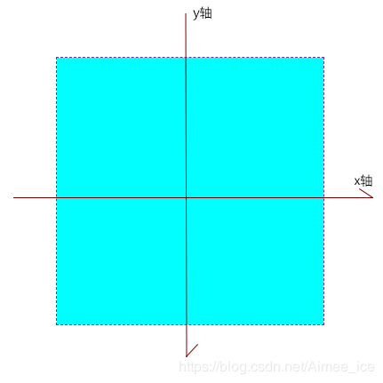
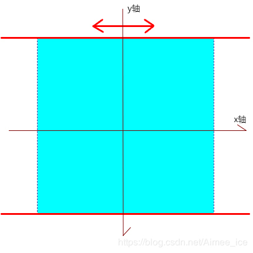
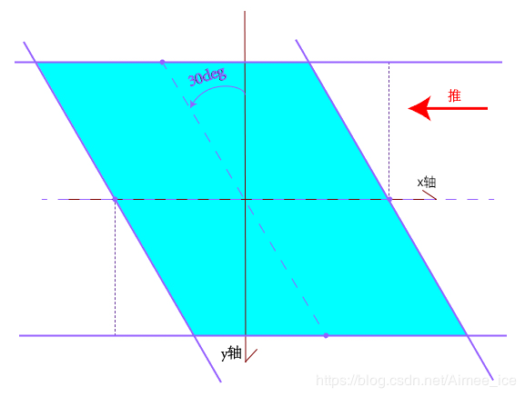
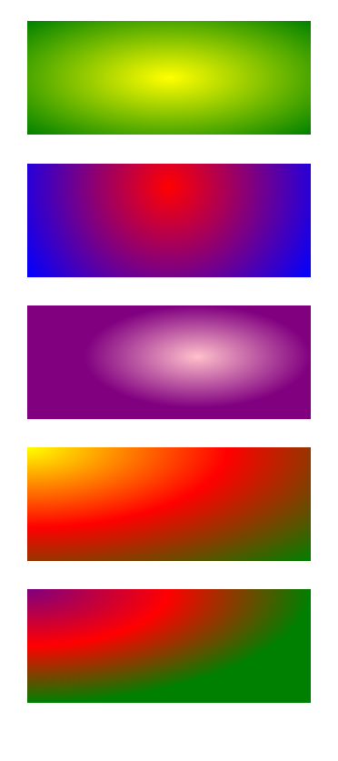
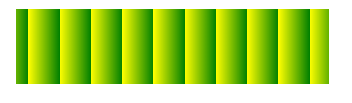
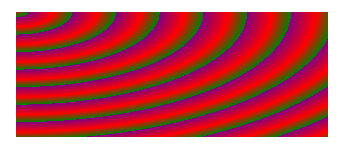
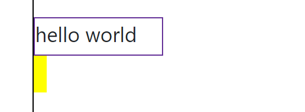
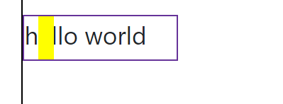
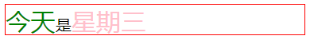
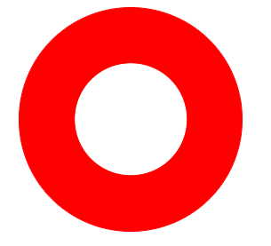

<!-- START doctoc generated TOC please keep comment here to allow auto update -->
<!-- DON'T EDIT THIS SECTION, INSTEAD RE-RUN doctoc TO UPDATE -->
**Table of Contents**  *generated with [DocToc](https://github.com/thlorenz/doctoc)*

- [CSS3 基础知识](#css3-%E5%9F%BA%E7%A1%80%E7%9F%A5%E8%AF%86)
  - [1. 形变 - transform](#1-%E5%BD%A2%E5%8F%98---transform)
    - [1. 2d 形变](#1-2d-%E5%BD%A2%E5%8F%98)
    - [2. 3d形变](#2-3d%E5%BD%A2%E5%8F%98)
  - [2. 过渡 - transition](#2-%E8%BF%87%E6%B8%A1---transition)
  - [3. 动画 - animation](#3-%E5%8A%A8%E7%94%BB---animation)
  - [4. 新增单位](#4-%E6%96%B0%E5%A2%9E%E5%8D%95%E4%BD%8D)
  - [5. 渐变-gradient](#5-%E6%B8%90%E5%8F%98-gradient)
    - [1. 线性渐变](#1-%E7%BA%BF%E6%80%A7%E6%B8%90%E5%8F%98)
    - [2. 径向渐变](#2-%E5%BE%84%E5%90%91%E6%B8%90%E5%8F%98)
    - [3. 重复渐变](#3-%E9%87%8D%E5%A4%8D%E6%B8%90%E5%8F%98)
  - [6. 新增选择器](#6-%E6%96%B0%E5%A2%9E%E9%80%89%E6%8B%A9%E5%99%A8)
    - [1. 属性选择器](#1-%E5%B1%9E%E6%80%A7%E9%80%89%E6%8B%A9%E5%99%A8)
    - [2. 结构伪类选择器](#2-%E7%BB%93%E6%9E%84%E4%BC%AA%E7%B1%BB%E9%80%89%E6%8B%A9%E5%99%A8)
  - [7. 伪元素](#7-%E4%BC%AA%E5%85%83%E7%B4%A0)

<!-- END doctoc generated TOC please keep comment here to allow auto update -->

# CSS3 基础知识

## 1. 形变 - transform

1. CSS3的形变分为 2d 形变和 3d 形变。

### 1. 2d 形变

1. 移位 - translate()
   - 改变元素在页面中的位置，类似于定位。
   - 语法：
     - `transform: translate(x) ;`    
     仅仅沿着 x 轴移动
     - `transform: translate(x, y) ;`  
     沿着x 轴、y 轴移动
     - `transform: translateX(n) ;`  
     仅仅沿着 x 轴移动
     - `transform: translateY(n) ;`  
     仅仅沿着 y 轴移动
   - x 和 y 的单位可以是 px，也可是百分比。必须写上单位，translate 属性才起作用。
   - 类似于 position 属性中的 relative 属性，移动的起点是相对于原来的位置而言的。
   - **最大的好处**：使用 translate() 函数，可以移动元素的位置，但是**不影响** x 轴、y 轴上的任何组件。
   - 特点：
     - 定义 2D 转换中的移动，沿着 X 轴、Y 轴移动。
     - 最大优点是不会影响其他元素的位置。
     - 如果移动的距离使用百分数，是相对于自身宽高而言的。
     - 对行内标签没有作用。
   - translate(x, y) 中的 x 和 y 可以设置负值。x 为负，向左移动，与为负，向上移动。
   - **translate(x, y) 对元素进行移动，移动的中心始终是元素的中点。**
   - 用途：
     1. 设置元素垂直居中。
     2. 动画。
     
2. 缩放 - scale()
   - 给元素添加了这个属性，就可以对元素进行放大或者缩小。
   - 使得元素沿着 x 轴或 y 轴方向进行放大或者缩小。
   - 语法：
     - `transform: scale(x) ;`  
     x 轴方向和 y 轴方向设置相同的缩放倍数
     - `transform: scale(x, y) ;`  
     设置 x 轴的缩放倍数为 x，y 轴的缩放倍数为 y
     - `transform: scaleX(n) ;`  
     设置 x 轴的缩放倍数为 n，y 轴不变
     - `transform: scaleY(n) ;`  
     设置 y 轴的缩放倍数为 n，x 轴不变
   - scale() 接收的缩放倍数就是一个纯数字。没有任何单位。
   - 缩放倍数在 0 到 1 之间，表示缩小，大于 1，表示放大。
   - **最大优势**
     1. 可以设置缩放中心，即以哪一个点为原点，对元素沿着 x 轴和 y 轴进行缩放。默认是以元素中心进行缩放。
     2. 使用scale () 缩放某个元素，不会影响其他元素的位置。
   - **如果通过设置 width 和 height，来改变元素的大小，实现缩放的效果，则会影响其他元素的位置，同时，缩放只能沿着特定方向进行，如宽度向两边延伸，高度向下延伸，没有 scale() 这样灵活。**
   
3. 旋转 - rotate()
   - 将一个元素按照指定的角度旋转。
   - 语法:
     - `transform: rotate(度数) ;`
   - 要点：
     1. rotate() 接收一个数字，表示旋转的度数，必须有单位，单位是deg。
     2. rotate() 接收的数字可以是正数，表示元素顺时针旋转，若是负数，表示元素逆时针旋转。
     3. 默认的旋转中心是元素的中心。
     
4. 倾斜 - skew()
   - 将一个元素倾斜显示。类似于将矩形变为平行四边形显示。
   - 将一个元素以其中心位置，围绕着 x 轴和 y 轴按照一定的角度进行倾斜。
   - 语法：
     - `transform: skew(x);`  
     图形仅在水平方向上形变（垂直方向上的高度不变）。  
     x 取值为正，X 轴不动，y 轴逆时针倾斜一定角度。  
     x 取值为负，X 轴不动，y 轴顺时针倾斜一定角度。
     - `transform: skew(x, y);`   
     图形在水平方向上形变，在垂直方向上也进行形变。  
     x 的值同上。  
     y 取值为正，y 轴不动,x 轴顺时针倾斜一定角度。  
     y 取值为负，y 轴不动,x 轴逆时针倾斜一定角度。
     - `transform: skewX(x);`  
     图形仅在水平方向上形变（垂直方向上的高度不变）。      
     等同于`transform: skew(x);`。
     - `transform: skewY(y);`   
     图形仅在垂直方向上形变（水平方向上的高度不变）。  
     等同于`transform: skew(0, y);`。
   - 默认的倾斜中心是元素的中心。
   - 使用 skew()，数值必须加上单位 deg。
   - 与 rotate() 的不同之处：
     - rotate() 只是对元素进行旋转，不改变元素的形状。
     - skew() 改变元素的形状，不对元素进行旋转。

5. 形变中心 - transform-origin
   - 这个属性用来设置形变的中心。
   - 语法：
     `transform-origin: x y;`  
     x 和 y 中间使用空格隔开。  
     x 和 y 可以使用数值（单位是像素）或者是方位名词（top、left、right、bottom、center）或者是百分比。
   - rotate()、scale() 和skew() 都可以通过设置 transform-origin 重置元素的中心。而translate() 的中心始终在元素的中点位置。
   - 默认的 x 和y 分别是 50% 50% 或 center center。
6. 2d 形变的综合写法：
   - 我们可以将多个形变的属性结合到一起来写。例如：`transform: translate(25px) rotate(45deg) scale(1.5);`
   
   - **注意**：要将移位属性 translate() 写到第一个位置。
   
7. skew() 详解
   - 下面的内容来自CSDN的博客：[CSS3 skew斜切效果详解](https://blog.csdn.net/aimee_ice/article/details/96283851)
   - 默认的坐标及其原点如图示1所示：
   - 图1：
   
   - 下面所有的讨论都是基于默认的坐标原点是元素的中心。
   - skewX(30deg) 就会把图片从图2 变为图3 的形状：
   - 图2：  
   
   - 图3：
   
   - 解释】首先要理清楚的是，skewX 是指图形在X轴方向上（也就是水平方向上进行变形），千万不要理解为它是 x 轴进行旋转！！其次，图形的边一定是和对应方向上的坐标轴平行的！也就是说，竖直方向上的边一定是和y轴平行。水平方向一定和x轴平行。
   - 再来弄清楚正负值的区别：
     - 只需要记住，不管是 skewX 还是 skewY 亦或是 skew，里面的参数取正时，往远离第一象限的方向旋转；取负值时，往靠近第一象限的方向旋转。  
     - 此时，相当于就有一只无形的手在水平方向上推图形（正值往左推，负值往右推），推动角度为参数 30deg（如图3红色箭头所示）。
     - 这样就可以在脑中推算出图形经过skew变形之后的大致形状了，比如：
       - skew(+x deg)（同 skewX(+x deg)），就是将图形往左推 x deg，就是一个尖角在左上和右下的平行四边形。
       - skew(-x deg)（同 skewX(-x deg)），就是将图形往右推 x deg，就是一个尖角在右上和左下的平行四边形。
       - skew(0，+y deg)（同skewY(+y deg)），就是将图形往下推 y deg，就是一个尖角在左上和右下的平行四边形。
       - skew(0，-y deg)（同 skewY(-y deg)），就是将图形往上推 y deg，就是一个尖角在左上和右下的平行四边形。
     - 复杂一点的话，就是两个一起设置非零的值，如：
       - skew(+x deg，+y deg)，就是先将图形推成上述第一点的样子，之后再向下推。其他情况与之类似。
     
   - 上述方法可以不动笔大概勾勒出经变形后的图形，但要精确画出来，请参照以下方法： 
     - 从旋转后产生的新坐标轴开始说起，新坐标轴与原图形的边（即图3黑色虚框）会产生四个交点（图3 紫色小圆点），过四个交点画平行于“对立”坐标轴的直线，一共会画四条（图3 紫色实线），画好之后，四条直线构成的封闭图形就是经变形后应得的图形。
     - 【TIPS】“对立”坐标轴的意思是：如果是新坐标轴中的x轴与原图形边产生的交点，那么过这个交点画平行于新坐标轴y轴的直线。
     - 这里有一个小问题：以图3 为例，如果旋转的角度超出了45度，如 skewX(60deg)，则y轴与原图形的交点会在左边和右边的这条边上，而不是上面和下面的边，所以，我们不能过这两个点分别画出与x轴平行的直线，这样会使得垂直方向的高度变小。与规则不符。所以在这种情况（旋转大于 45 度）下，我们只需考虑x轴与原图形的交点即可。分别画出过这两个交点且平行于旋转后的y轴的直线，这两个直线与原图形上下两条边所在的直线（与原 x 轴平行）相交，构成的封闭图形，就是倾斜后的图形。
     
### 2. 3d形变

1. 移位
   - 主要包括 translate3d() 和 translateZ() 两个函数。
   
2. 缩放
   - 主要包括 scale3d() 和 scaleZ() 两个函数。
   
3. 旋转
   - 主要包括 rotateX()、rotateY() 和 rotateZ() 三个函数。

## 2. 过渡 - transition

1. 过渡是一种动画，从一个状态缓慢的变成另外一种状态。

2. 用于实现两种效果的切换。也就是不是从一种效果立即切换到另外一种效果，而是缓慢过渡到另外一种效果。

3. 适用场景：
   - 鼠标点击
   - 鼠标悬浮
   - 获得焦点
   - 元素的任何改变
   
4. 创建简单过渡的效果：
   1. 在默认样式中声明元素的初始状态样式
   2. 声明过渡元素最终状态样式，比如悬浮样式
   3. 在默认样式中通过添加过渡函数，添加一些不同的样式
   
5. 语法：
   - `transition: property duration timing-function delay;`
   - property：想要变化的 css 属性，可以是宽度、高度、背景颜色、内外边距等。如果想要所有的属性都变化过渡，写一个 all 就可以。
   - duration：过渡持续时间。单位是s。
   - timing-function: 过渡曲线，默认是 ease（可以省略），过渡曲线的类型与动画的类似，这里就不多说了。
   - delay：延迟。表示经过长时间过渡开始，单位也是 s。默认是 0，可以省略。
6. 过渡应用口诀：谁做过渡给谁加。即哪个元素要使用过渡，我们就在这个元素的默认样式中添加过渡 transition。
7. 可以给一个元素添加多个过渡效果，每个属性的过渡声明之间使用逗号分隔，如下所示：  
`transition: translate 0.8s ease, scale 1s ease-in 0.5s;`

## 3. 动画 - animation

## 4. 新增单位

1. rem
   - 在W3C官网上是这样描述rem的
     > font size of the root element
   - 1rem = html页面根元素的字体大小
   - em单位是相对于父节点的 font-size，会有一些组合的问题（必须知道每个父元素的字体大小），而 rem 是相对于根节点（或者是html节点），意思就是说你可以在html节 点定义一个单独的字体大小，然后所有其他元素使用rem相对于这个字体的百分比进行设置，这样就意味着，我们只需要在根元素确定一个参考值即可。使用 rem，这个数值就是确定的。
   
2. vh
   - 1vh = 视窗高度*1%
   
3. vw  
   - 1vw = 视窗宽度*1%
   
4. vmin
   - 如果视窗的宽度小于高度，1vmin = 1vw
   - 如果视窗的宽度大于高度，1vmin = 1vh
   
5. vmax
   - 如果视窗的宽度小于高度，1vmax = 1vh
   - 如果视窗的宽度大于高度，1vmax = 1vw
   
6. 用途：
   - vh 和 vw 用于设置元素垂直居中。
   - 新增的单位主要用于移动端布局使用，在移动端的兼容性很好。
   
## 5. 渐变-gradient

1. **渐变都是属于background-image的属性。**

### 1. 线性渐变

1. 这是背景background的一个新增属性。我的理解是，这就是一个颜色的过渡，即从一个颜色平缓的变化的另外一个颜色。

2. 线性渐变，就是颜色沿着一条直线过渡：从左侧到右侧、从右侧到左侧、从顶部到底部、从底部到顶部或者沿着任意轴。

3. 语法：
   - 由于线性渐变存在浏览器兼容性问题，使用时，必须加上浏览器的私有前缀。
   - chrome浏览器：`background: -webkit-linear-gradient(起始方向,起始颜色,终点颜色);`
   - firefox浏览器：`background: -moz-linear-gradient(起始方向,起始颜色,终点颜色);`
   - 标准语法：`background: linear-gradient(起始方向,起始颜色,终点颜色);`
   - 参数解释：
     1. 起始方向可以使用两个值：角度和关键词。
        - 角度：在 0~360 之间的数字后面加上 deg，指定过渡在哪个方向结束。例如， 0deg 表示元素的顶边，所以过渡从底边开始，到顶边结束。  
        0 度表示从下到上，90 度表示从从左到右。等等。正角度都属于顺时针方向。 而负角度意味着逆时针方向。  
        角度的值按顺时针方向旋转，因此，90deg 表示元素的右边（与 to right 相同），180deg 表示元素的底边（与 to bottom 相同），270deg 表示元素的左边（与 to left 相同）。  
        使用角度值时，浏览器会绘制一条经过元素中心点的假象线。指定的角度就是这条线的角度，同时还指明过渡在哪里结束。（参考文献：[【CSS】渐变背景（background-image）](https://www.jianshu.com/p/58b340a037ea)） 
        - 关键词：主要有 `to top`、`to right`、`to bottom`、`to right`、`to left`。对应的角度分别是：0 度、90 度、180 度和 270 度。除了使用 `to top`和`to left` 之外，还可以使用 `top left` 表示从左上角到右下角，`top right` 表示从右上角到左下角等。
     2. 起始颜色和终止颜色：表示颜色的起点和终点。大家可以从中插入更多的颜色值。
     
4. **注意**：最新版的 firefox 和 chrome 已经支持渐变。因此可以不添加浏览器私有前缀。

5. 用法示例：
   - html代码：
     ```html
        <div class="test"></div>
     ```
   - css样式：
     ```css
        div {
           margin: 25px auto;
        }
        .one {
           width: 250px;
           height: 45px;
           /*从左向右渐变*/
           background-image: linear-gradient(to right, yellow, green);
           background-image: -webkit-linear-gradient(to right, yellow, green);
           background-image: -moz-linear-gradient(to right, yellow, green);
        }
        .two {
           width: 250px;
            height: 45px;
            /*从上到下渐变*/
            background-image: linear-gradient(to bottom, red, blue);
        
        }
        .three {
            width: 250px;
            height: 45px;
            /*左上角到右下角渐变*/
            background-image: linear-gradient(to bottom right, pink, purple);
        
        }
        .four {
             width: 250px;
             height: 45px;
             /*使用角度，180度表示从上到下*/
             /*插入多个颜色*/
             background-image: linear-gradient(180deg, yellow, red, green);
        
        }
     ```
   - 效果：  
   
   
### 2. 径向渐变

1. 径向渐变是圆形或者椭圆形渐变，颜色不再沿着一条直线轴变化，而是从一个起点朝所有方向混合。

2. 语法：
   - chrome浏览器：`background: -webkit-radial-gradient(形状,圆心位置,形状大小,起始颜色,终点颜色);`
   - firefox浏览器：`background: -moz-radial-gradient(形状,圆心位置,形状大小,起始颜色,终点颜色);`
   - 标准语法：`background: linear-gradient(形状,圆心位置,形状大小,起始颜色,终点颜色);`
   - 参数解释：
     1. 形状 - shape：定义径向渐变的形状。主要包括两个值：circle 和 ellipse。即圆形和椭圆形。
     2. 圆心位置 - position：定义径向渐变的圆心位置。类似于 css 中 background-position 属性，用于确定元素渐变的中心位置。这个参数可以省略，默认值为 center。如果为其他值，需要加上 at，例如：at 50% 50%。主要值有下面几种：
       - length：用长度值指定径向渐变圆心的横纵坐标。可以为负值。
       - percentage：用百分比指定径向渐变圆心的横纵坐标。
       - left：设置左边为径向渐变圆心的横坐标值。
       - center：设置中间为径向渐变圆心的横坐标或纵坐标。
       - right：设置右边为径向渐变圆心的横坐标值。
       - top：设置顶部为径向渐变圆心的纵坐标值。
       - bottom：设置左边为径向渐变圆心的纵坐标值。
    3. 形状大小 - size：用来确定径向渐变的结束形状大小。如果省略，默认值是 farthest-corner。还可以设置其他值：
       - closest-side：指定径向渐变的半径长度为从圆心到离圆心最近的边。
       - closest-corner：指定径向渐变的半径长度为从圆心到离圆心最近的角。
       - farthest-side：指定径向渐变的半径长度为从圆心到离圆心最远的边。
       - farthest-corner：指定径向渐变的半径长度为从圆心到离圆心最远的角。
       - 如果 shape 设置为 circle 或者省略，size 可能显示设置为 length，表示用长度值指定径向渐变的横向或者纵向直径长度，并根据横向和纵向的直径来确定径向渐变的形状是圆或者椭圆，不能为负值。
       - 如果 shape 设置为 ellipse 或者省略，size 可能显示设置为 length | percentage，主要用来设置椭圆的大小。第一个值表示椭圆水平半径，第二值表示垂直半径。这个值，除了使用 length，还可以使用 percentage来定义。使用 percentage 定义值是相对于径向渐变容器的尺寸，不能为负值。
       - **注意**：shape 和 size 设置一个就可以，同时设置，以 shape 为准。
     4. 起始颜色和终止颜色：表示颜色的起点和终点。大家可以从中插入更多的颜色值。
3. 用法示例：
   - HTML结构：
     ```html
        <div class="one"></div>
        <div class="two"></div>
        <div class="three"></div>
        <div class="four"></div>
        <div class="five"></div>
     ```
   - css样式：
     ```css
        div {
           margin: 25px auto;
           width: 250px;
           height: 100px;
        }
        .one {
        
           /*径向渐变渐变*/
           /*默认的中心的center*/
           background-image: radial-gradient(yellow, green);
           background-image: -webkit-radial-gradient(yellow, green);
           background-image: -moz-radial-gradient(yellow, green);
        }
        .two {
        
           /*指定渐变的形状和中心*/
           background-image: radial-gradient(circle at 50% 20%, red, blue);
        
        }
        .three {
        
           /*指定渐变的结束形状大小（size），并指定中心。（注意，size和shape不能同时出现）*/
           background-image: radial-gradient(closest-side at 60% 45%, pink, purple);
        
        }
        .four {
            /*椭圆形渐变*/
           background-image: radial-gradient(ellipse at top left, yellow, red, green);
        
        }
        .five {
           background-image: radial-gradient(farthest-side at top left, purple, red, green);
        }
     ```
   - 效果：  
   
   
### 3. 重复渐变

1. 重复线性渐变
   - 将一个渐变重复，在一个区域内平铺开来。
   - 语法（与线性渐变参数相同）：
     - `repeating-linear-gradient(起始方向,起始颜色,终点颜色);`
     - **注意**：在使用重复线性渐变的时候，必须指定每个颜色的位置。
   - 用法示例：
     ```html
        <div class="one"></div>
     ```
   - css样式：
     ```css
        div {
                    margin: 25px auto;
                    width: 250px;
                    height: 60px;
        }
        .one {
        
            /*从左向右渐变*/
            /*从左边开始，前35像素是黄色，此后直至60像素的位置过渡到绿色，绘制完这个渐变后，浏览器会像平铺图像那样把这个渐变铺满整个背景。*/
            background-image: repeating-linear-gradient(to right, yellow 35px, green 60px);
            background-image: -webkit-repeating-linear-gradient(to right, yellow 35px, green 60px);
            background-image: -moz-repeating-linear-gradient(to right, yellow 35px, green 60px);
        }
     ```
   - 图示：  
   
   
2. 重复径向渐变
   - 语法（与径向渐变参数相同）：
     - `repeating-radial-gradient(形状,圆心位置,形状大小,起始颜色,终点颜色);`
     - **注意**：在使用重复径向渐变的时候，必须指定每个颜色的位置。
   - 用法示例：
        ```html
           <div class="five"></div>
        ```
      - css样式：
        ```css
           div {
                       margin: 25px auto;
                       width: 250px;
                       height: 100px;
           }
           .five {
              background-image: repeating-radial-gradient(farthest-side at top left, purple 10px, red 30px, green 45px);
           
           }
        ```
      - 图示：  
      
      
## 6. 新增选择器

1. **注意**：类选择器、属性选择器和伪类选择器权重相同，均为10。

### 1. 属性选择器

1. 基本说明

   选择符|说明
   :---:|:---:
   E[attr]|选择具有attr属性的E元素
   E[attr="val"]|选择具有attr属性且属性值为val的E元素
   E[attr^="val"]|选择具有attr属性且属性值以val开头的E元素
   E[attr$="val"]|选择具有attr属性且属性值以val结尾的E元素
   E[attr*="val"]|选择具有attr属性且属性值包含val的E元素

### 2. 结构伪类选择器

1. 基本说明

   选择符|说明
   :---:|:---:
   E:first-child|匹配父元素中第一个子元素E，等同于E:nth-child(1)
   E:last-child|匹配父元素中最后一个子元素E，等同于E:nth-last-child(1)
   E F:nth-child(n)|选择父元素E中第n个子元素F。
   E F:nth-last-child(n)|选择父元素E中倒数第n个子元素F。与E F:nth-child(n)正好相反。
   E:first-of-type|选择父元素内具有指定类型的第1个元素E
   E:last-of-type|选择父元素内具有指定类型的倒数第1个元素E
   E:nth-of-type(n)|选择父元素内具有指定类型的第n个元素E
   E:nth-last-of-type(n)|选择父元素内具有指定类型的倒数第n个元素E
   E:only-child|选择父元素值包含一个子元素，且该子元素匹配E元素
   E:only-of-type|选择父元素值包含一个同类型子元素，且该子元素匹配E元素
   E:empty|选择没有子元素的元素，且元素不包含任何文本节点。

2. nth-child(n) 中的 n 的详解：
   1. n可以是一个正整数，如1、2、3，为0时，选择不到任何元素。
   2. n为关键字：even表示奇数，选择第奇数个元素，odd为偶数，选择第偶数个元素。
   3. n为公式，则n从0开始计算（第0个或者超出了元素个数则会被忽略）
      - 2n+1 （1 3 5 ...） 奇数
      - 2n+1 （0 2 4 ...） 偶数
      - n+3 （3 4 5 ...） 从第三个元素开始
      - -n+4 （4 3 2 1 0 ...） 选择前4个元素
      
3. nth-of-type(n) 和 nth-child(n) 区别
   1. nth-child  只选择第几个子元素，不管类型是否相同。nth-child 是从所有的子级元素开始计算，可能不是同一种类型。
   2. nth-of-type 选择同类型的子元素。例如：`ul li:nth-of-type(2)`表示选择第二个 li 元素。类型必须是 li。
  
4. 代码说明：
     - html结构：
     ```html
        <div>
            <p>这是一个p标签</p>
            <p>这是一个p标签</p>
            <span>我是span</span>
            <span>我是span</span>
            <span>我是span</span>
            <span>我是span</span>
        </div>
     ```
     - 我想选出div中第一个span元素，如果这样写：`div span:nth-child(1) {}`，是选不出任何元素的，因为这个选择选择的是div中的第一个子元素span，而实际上第一个子元素是p。
     - 所以，可以这样写：`div span:nth-of-type(1) {}`，表示选择div中第一个类型是span的子元素。


### 3. `:not()` 选择器

1. `:not()` 接收一个选择器，然后将这个选择器选中的元素排除。

2. `:not()` 接收的选择器不能是 `:not()` 本身。即不能嵌套使用。

3. 示例：
   - css 代码：
   ```css
      .sibcont{
          background:#f1f1f1;
          border:1px solid #bababa;
          margin:20px;
          padding:20px;
      }
      .sibcont ul{
          margin:0;
          padding:0;
          list-style:none;
      }
      .sibcont ul li{
          color:#C91010;
          font-size:13px;
          line-height:26px;
      }
      //not选择器
      .sibcont ul li:not(:first-child){
          color:#0C58A7;
      }
   ```
   - html 结构：
     ```
       <div class="sibcont">
           <ul>
              <li>妹子前端</li>
              <li>妹纸前端</li>
              <li>mooshine前端</li>
              <li>not()选择器</li>
           </ul>
       </div>
     ```
   - 不选择第一个 li 元素，其余 li 元素设置文字颜色。


4. `:not()` 不可用嵌套使用，但是可以并列使用。
   - css 代码：
   ```css
      .sibcont ul li{
          color:#C91010;
          font-size:13px;
          line-height:26px;
      }
      .sibcont ul li:not(:first-child):not(:last-child){
          color:#0C58A7;
      }
   ```
   - 即不选择第一个 li 元素，也不选择最后一个 li 元素，对其余的 li 元素设置文字颜色。

5. 参考资料：[css :not()函数多个条件使用](http://www.webfront-js.com/articaldetail/62.html)

## 7. 伪元素

1. 伪元素可以用于定位文档中包含的文本，但是无法在文档树中定位。就是说不会生成一个真正的元素，因此称为伪元素。伪元素一般反应无法在 CSS 中轻松或可靠的检测到某个元素属性或状态，另一方面，伪元素表示 DOM 外部的某种文档结构。

2. 类型：
   - `::first-line`
   - `::first-letter`
   - `::before`
   - `::after`
   - `::selection`

3. CSS3 中的伪元素，实际上一直存在于 CSS 中。只不过用一个冒号（`:`）表示，即`:first-line`、`:firstl-letter`、`:before`、`:after`。CSS3中做了调整，变成了双冒号（`::`），同伪类选择器区分。

4. 这里主要讲解 `::before` 和 `::after`。
   1. 含义：
     - `::before` 在元素的内容前面插入内容。
     - `::after` 在元素的内容后面插入内容。
   2. `::before` 和 `::after` 必须具有 content 属性。
   3. `::before` 在内容前面，`::after` 在内容后面。
   4. `::before` 和 `::after` 创建一个元素，属于行内元素。想要变成块级元素，必须设置 display 属性为 block。
   5. 因为在 DOM 中看不见刚刚创建的元素，所以被称为伪元素。
   6. 伪元素和标签选择器一样，权重为 1。
   7. 用途：
      - 需要嵌套一个 html 元素完成的，都可以使用伪元素替代。
      - 字体图标。
      - 清除浮动。

5. 伪元素与定位
   - `::before` 定位的基准是其主元素的右上角，`::after` 定位的基准是主元素的结尾处。
   - `::before` 与 `::after` 的主要用途是对元素默认样式的的美化。美化时需要结合定位。一般讲主元素设置为 `position：relative`，伪元素设置为 `position：absolute`，以方便对伪元素进行绝对定位。
   - 对伪元素进行定位，设置 `relative` 是基于其原本出现的位置进行定位。而设置 `absolute` 则是基于第一个非 `static` 的父元素进行定位。而且会脱离文档流。因此我们要设置其主元素的 `position` 为 `relative`，这样绝对定位的伪元素就是基于主元素进行定位。
   - 如果对伪元素设置了绝对定位，同时设置主元素为相对定位，不对伪元素设置 `top`、`left`、`right` 和 `bottom`，那么伪元素的位置还是原本出现的位置。

6. 伪元素定位示例：
   - HTML 结构：
     ```html
        <div className="test-box">
            <div className="inner-box">
                 hello world
            </div>
        </div>
     ```
   - css 样式：
     ```css
        .test-box {
            position: relative;
        }
        .test-box .inner-box {
            width: 100px;
            height: 30px;
            border: 1px solid rebeccapurple;
        }

        .test-box::after {
            content: '';
            width: 10px;
            height: 28px;
            display: block;
            position: absolute;
            background-color: yellow;
       }
     ```
     此时伪元素没有设置 `top`、`left`、`right` 和 `bottom`，那么伪元素的位置还是原本出现的位置。如下图所示：
     
     设置了方位，css 如下所示：
     ```css
        .test-box::after {
            content: '';
            width: 10px;
            height: 28px;
            display: block;
            position: absolute;
            top: 1px;
            left: 10px;
            background-color: yellow;
        }
     ```
     结果如下图所示：
     

6. 伪元素用法示例 - 1：
   - HTML 结构：
     ```html
        <div class="test">是</div>
     ```
   - css 样式：
     ```css
        .test {
            width: 300px;
            height: 30px;
            border: 1px solid red;
        }
        .test::before {
            content: '今天';
            font-size: 25px;
            color:green;
        }
        .test::after {
             content: '星期三';
             font-size: 25px;
             color: pink;
           }
        ```
   - 效果：  
     
   - 上例等同于下面的 html 结构：
     ```html
        <div class="test">
            <span>今天</span>
            是
            <span>星期三</span>
        </div>
     ```

7. 用法示例 - 2（纯 css 实现一个圆环）：
   - HTML结构：
     ```html
           <div class="outer"></div>
     ```
   - css样式：
     ```css
        .outer {
            width: 200px;
            height: 200px;
            border: 1px solid red;
            border-radius: 50%;
            position: relative;
            background: red;
            margin: 0 auto;
        }
        .outer::after {
             content: '';
             /*将伪元素变成块级元素*/
             display: block;
             width: 100px;
             height: 100px;
             border: 1px solid red;
             border-radius: 50%;
             background: white;
             position: absolute;
             top: 50%;
             left: 50%;
             transform: translate(-50%, -50%);
        }
        ```
   - 效果：  
     
7. 用法示例-3（清除浮动）：
   - css样式：
     ```css
        .clearfix::after {
              /*\200B表示一个零宽度的空格*/
              content: '\200B';
              clear: both;
              display:block;
              height: 0;
        } 
     ```  


