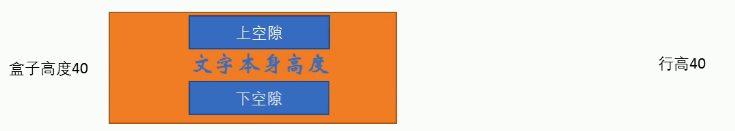

<!-- START doctoc generated TOC please keep comment here to allow auto update -->
<!-- DON'T EDIT THIS SECTION, INSTEAD RE-RUN doctoc TO UPDATE -->
**Table of Contents**  *generated with [DocToc](https://github.com/thlorenz/doctoc)*

- [css 基础知识](#css-%E5%9F%BA%E7%A1%80%E7%9F%A5%E8%AF%86)
  - [1. 盒模型](#1-%E7%9B%92%E6%A8%A1%E5%9E%8B)
    - [1. 内容区 - content](#1-%E5%86%85%E5%AE%B9%E5%8C%BA---content)
    - [2. 内边距（补白）- padding](#2-%E5%86%85%E8%BE%B9%E8%B7%9D%E8%A1%A5%E7%99%BD--padding)
    - [3. 边框 - border](#3-%E8%BE%B9%E6%A1%86---border)
    - [4. 外边距 - margin](#4-%E5%A4%96%E8%BE%B9%E8%B7%9D---margin)
  - [2. 选择器优先级](#2-%E9%80%89%E6%8B%A9%E5%99%A8%E4%BC%98%E5%85%88%E7%BA%A7)
  - [3. 垂直居中](#3-%E5%9E%82%E7%9B%B4%E5%B1%85%E4%B8%AD)
    - [1. 基于绝对定位的解决方案](#1-%E5%9F%BA%E4%BA%8E%E7%BB%9D%E5%AF%B9%E5%AE%9A%E4%BD%8D%E7%9A%84%E8%A7%A3%E5%86%B3%E6%96%B9%E6%A1%88)
    - [2. 基于 flex 的解决方案](#2-%E5%9F%BA%E4%BA%8E-flex-%E7%9A%84%E8%A7%A3%E5%86%B3%E6%96%B9%E6%A1%88)
    - [3. 文本的垂直居中](#3-%E6%96%87%E6%9C%AC%E7%9A%84%E5%9E%82%E7%9B%B4%E5%B1%85%E4%B8%AD)
  - [4. 水平居中](#4-%E6%B0%B4%E5%B9%B3%E5%B1%85%E4%B8%AD)
    - [1. 行内元素](#1-%E8%A1%8C%E5%86%85%E5%85%83%E7%B4%A0)
    - [2. 块级元素](#2-%E5%9D%97%E7%BA%A7%E5%85%83%E7%B4%A0)
    - [3. 使用 flex 布局](#3-%E4%BD%BF%E7%94%A8-flex-%E5%B8%83%E5%B1%80)
  - [5. 清除浮动](#5-%E6%B8%85%E9%99%A4%E6%B5%AE%E5%8A%A8)
    - [1. clear 属性](#1-clear-%E5%B1%9E%E6%80%A7)
    - [2. overflow 属性](#2-overflow-%E5%B1%9E%E6%80%A7)
  - [6. BFC](#6-bfc)
  - [7. 常用单位](#7-%E5%B8%B8%E7%94%A8%E5%8D%95%E4%BD%8D)
  - [8. 背景 - background](#8-%E8%83%8C%E6%99%AF---background)
    - [1. background-color](#1-background-color)
    - [2. background-image](#2-background-image)
    - [3. background-repeat](#3-background-repeat)
    - [4. background-position](#4-background-position)
    - [5. background-attachment](#5-background-attachment)
    - [6. 背景透明](#6-%E8%83%8C%E6%99%AF%E9%80%8F%E6%98%8E)
    - [7. background-size](#7-background-size)
    - [8. background-origin](#8-background-origin)
    - [9. background-clip](#9-background-clip)
    - [10. 背景属性的复合写法](#10-%E8%83%8C%E6%99%AF%E5%B1%9E%E6%80%A7%E7%9A%84%E5%A4%8D%E5%90%88%E5%86%99%E6%B3%95)
    - [11. 多背景图像](#11-%E5%A4%9A%E8%83%8C%E6%99%AF%E5%9B%BE%E5%83%8F)
  - [9. 字体 - font](#9-%E5%AD%97%E4%BD%93---font)
  - [10. 浮动 - float](#10-%E6%B5%AE%E5%8A%A8---float)
  - [11. 定位 - position](#11-%E5%AE%9A%E4%BD%8D---position)
    - [1. relative](#1-relative)
    - [2. absolute](#2-absolute)
    - [3. fixed](#3-fixed)

<!-- END doctoc generated TOC please keep comment here to allow auto update -->

# css 基础知识

## 1. 盒模型

### 1. 内容区 - content

### 2. 内边距（补白）- padding

### 3. 边框 - border

### 4. 外边距 - margin

## 2. 选择器优先级

## 3. 垂直居中

### 1. 基于绝对定位的解决方案

1. html结构是：
   ```html
   <body>
       <main>
           <h1>Am I centered yet?</h1>
           <p>Center me, please!</p>
       </main>
   </body>

   ```
2. 元素具有固定宽高  
   - css样式：
      ```css
           main {
              position: absolute;
              top: 50%;
              left: 50%;
              /*自身宽度的一半*/
              margin-left: -9em;
              /*自身高度的一半*/
              margin-top: -5em;
              width: 18em;
              height: 10em;
              background: #c7254e;
        
           }
      ```
   - 使用calc()函数，省去写margin-left和margin-top。
     ```css
        main {
          position: absolute;
          top: calc(50% - 5em);
          left: calc(50% - 9em);
          width: 18em;
          height: 10em;
          background: #c7254e;

        }
     ```
3. 元素没有固定宽高  
   - 使用 css3 中新添加的 tranlate() 函数，。这个函数使用百分比值时，是以这个元素自身的宽度和高度为基准进行换算和移动的。这样就不需要我们指定元素的宽高了。
     ```css
         main {
          position: absolute;
          top: 50%;
          left: 50%;
          transform: translate(-50%);
          background: #c7254e;

         }
     ```
### 2. 基于 flex 的解决方案

1. html结构是：
   ```html
      <div class="container">
         <div class="center"></div>
      </div>
   ```
2. css样式为：
   ```css
      .container {
         display: flex;
         align-items: center;
      }
   ```
### 3. 文本的垂直居中

1. 单行文本
   - 对于单行文本，我们只需要将文本行高 `line-height` 和所在区域高度 `height` 设为一致即可。
   - 原理：行高 `line-height` 由三部分组成：上空隙、文字本身高度和下空隙组成。如下图所示：  
   
   - 那么单行文本垂直居中，原理就好理解了：  
   行高的上空隙和下空隙把文字挤到中间，如果行高小于盒子高度，文字就会偏上，如果行高大于盒子高度，文字则偏下。图示如下：  
   
   - html结构如下：
     ```html
        <div class="test">这是一行</div>
     ```
   - css样式如下：
     ```css
        .test {
            width: 35px;
            height: 40px;
            text-align: center;
            /*文本行高 line-height 和所在区域高度 height 一致，文本即可垂直居中*/
            line-height: 40px;
         }
     ```
2. 多行文本
   1. 父级元素高度不固定，随着内容变化
      - 解决方法：父级高度不固定的时，高度只能通过内部文本来撑开。这样，我们可以通过设置内填充 padding 的值来使文本看起来垂直居中，只需设置 padding-top 和 padding-bottom 的值相等。
      - html结构：
        ```css
           <div id="div1">
               这是多行文本垂直居中，
               这是多行文本垂直居中，
               这是多行文本垂直居中，
               这是多行文本垂直居中。
           </div>
        ```
      - css结构：
        ```css
           #div1 {
               width: 300px;
               border: 1px solid red;
               margin: 50px auto;
               text-align: center;
               padding: 35px 20px;
           }
         ```
   2. 父级元素高度不固定，随着内容变化
      - css 中的 vertical-align 属性，但是它只对拥有 valign 特性的元素才生效（div、span 不具有 valign 特性），结合`display: table;`，可以使得 div 模拟 table 属性。因此我们可以设置父级 div 的 displa y属性：`display: table;`；然后再添加一个 div 包含文本内容，设置其`display:table-cell;`和`vertical-align:middle;`。
      - html代码：
        ```html
           <div class="container">
               <div id="div2">
                   这是多行文本垂直居中，
                   这是多行文本垂直居中，
                   这是多行文本垂直居中，
                   这是多行文本垂直居中。
               </div>
           </div>
        ```
      - css代码：
        ```css
           /*元素具有固定的宽高，设置多行文本垂直居中*/
            .container {
                width: 400px;
                height: 200px;
                margin: 50px auto;
                border: 1px solid red;
                /*外层元素的display属性设置为table，这样可以使用vertical-align（垂直对齐）属性*/
                display: table;
            }
            .container #div2 {
                width: 100%;
                /*内层元素display属性设置为table-cell，表示这是表格的单元格*/
                display: table-cell;
                /*设置vertical-align（垂直对齐）为middle，则可设置文本垂直居中*/
                vertical-align: middle;
                text-align: center;
            }
        ```
## 4. 水平居中

### 1. 行内元素

1. css 样式：`text-align: center;`

### 2. 块级元素

1. css 样式：`margin： 0 auto;`

### 3. 使用 flex 布局

1. html 结构：
   ```html
      <div class="container">
         <div class="center">水平居中</div>
      </div>
   ```
2. css 样式：
   ```css
      .container {
         display: flex;
         display-direction: row;
         justify-content: center;
      }
   ```
## 5. 清除浮动

### 1. clear 属性

1. css 样式：`clear: left/right/both;`

### 2. overflow 属性

2. css样式：`overflow: hidden;`

## 6. BFC

## 7. 常用单位

1. px

2. em

3. 百分比

4. rem

5. vh

6. vw

## 8. 背景 - background

### 1. background-color

1. 设置元素的背景颜色。属性值可以是颜色关键字、十六进制颜色代码、rgb() 或hls()。默认值是 transparent，即透明。

### 2. background-image

1. 用途：常见于logo或者装饰性的小图片，或者超大的背景图片。优点是非常便于控制位置。

2. 语法：
   - `background-image: url(图片路径);`
   
3. 参数说明：
   - none：无背景图片（默认值）
   - url()：使用绝对路径或相对路径指定的背景图片
   
### 3. background-repeat

1. 控制背景图片是否重复。

2. 语法：
   - `background-repeat: repeat|no-repeat|repeat-x|repeat-y;`
   
### 4. background-position

1. 改变图片在背景中的位置。

2. 语法：
   - `background-position: x y;`
   
3. x和y表示横纵坐标，可选的值如下：
   - length：百分数|由浮点数和单位标识组成的长度值
   - position：方位名词，水平方向是：left | center | right。垂直方向是：top | center | bottom。
   
4. 参数说明：
   1. 方位名词：
      - 应用的是对齐规则，而不是坐标规则。x 为 left 表示图像的左边与元素的左边对齐，为 right 表示图像的右边和元素的右边对齐，为 center 表示图像的水平方向的中点和元素水平方向的中点对齐；y 为 top 表示图像的顶部和元素的顶部对齐，为 bottom 表示图像的底部和对象的底部对齐，为 center 表示图像的垂直方向的中点和垂直水平方向的中点对齐。
      - 方位名词与顺序无关。也就是`background-position: left top;`与`background-position: top left;`效果相同。
      - 如果只指定了一个方位名词，另外一个值省略，则第二值默认是center。
      - 使用方位名词对背景图片进行定位：
        - css样式：
          ```css
             div.test {
                width: 400px;
                height: 200px;
                border: 1px solid black;
                background-image: url(../media/logo.png);
                background-repeat: no-repeat;
                
                background-position: center center;
             }
          ```
        - 图示：
        
   2. 百分数
      - 是将图像本身（x%, y%）的那个点，与背景区域的（x%, y%）的那个点重合。最终得到背景图像起始位置坐标的计算公式为：  
      **x = (对象的宽度 - 图像的宽度) * x% ;**  
      **y = (对象的高度 - 图像的高度) * y% ;**  
      例如：`background-position: 75% 50%;`，那么背景图片的最终位置如下图所示：  
      
      - 例如，设置background-position为50% 50%。则x和y坐标分别是：  
      x = (400 - 200) * 50% = 100px;  
      y = (200 - 54) * 50% = 73px;  
      也是达到了方位名词center center的效果。
      - 百分数还可以是负值。计算规则同上。例如，设置background-position为-20% -10%。则x和y坐标是：  
      x = (400 - 200) * (-20%) = -40px;  
      y = (200 - 54) * (-10%) = -14.6px;    
      x和y坐标均为负值，则背景图片有一部分在元素之外，所以只显示在元素之内的背景图片的部分。
      - 使用负的百分数对背景图片进行定位：
        - css样式：
          ```css
             div.test {
                width: 400px;
                height: 200px;
                border: 1px solid black;
                background-image: url(../media/logo.png);
                background-repeat: no-repeat;
                /*使用负百分数*/
                background-position: -20% -10%;
             }
           ```
        - 图示：  
        
   3. 长度值
      - 表示使用长度值定位，是将背景图像的左上角，放置在对象的背景区域中（x, y）所指定的位置，即 x, y 定义的是背景图像的左上角，相对于背景区域左上角的偏移量。
      - 偏移量长度可以是正值，也可以是负值。x 为正值表示向右偏移，负值表示向左偏移；y 为正值表示向下偏移，负值表示向上偏移。背景图像发生移动后，就有可能超出对象的背景区域。此时，超出的部分将不会显示，只会显示落入背景区域的部分。
      - 使用长度值对背景图片进行定位：
      - 长度值为正值：
        - css样式：
          ```css
             .test {
                width: 400px;
                height: 200px;
                border: 1px solid black;
                background-image: url(../media/logo.png);
                background-repeat: no-repeat;
                /* x, y 定义的是背景图像的左上角，相对于背景区域左上角的偏移量。*/
                background-position: 100px 73px;
                
             }
          ```
        - 图示：
          
        效果同`background-position: center center;`相同。
      - 长度值为负值：
        - css样式：
          ```css
             .test {
                width: 400px;
                height: 200px;
                border: 1px solid black;
                background-image: url(../media/logo.png);
                background-repeat: no-repeat;
                background-color: #666;
                /* x, y 定义的是背景图像的左上角，相对于背景区域左上角的偏移量。*/
                background-position: -100px 0px;
                      
             }
           ```
        - 图示：
            
          背景图片向左移动，有一部分超出了元素的范围，因此不会被显示。  
            
5. 参考文献：[CSS 背景位置 background-position属性](https://blog.csdn.net/ixygj197875/article/details/79333151)

6. 方位名词和长度（包含长度值和百分数）可以混合，则第一个值是x坐标，第二个值是y坐标。

### 5. background-attachment

1. 这个属性设置背景图像是否固定或者随着页面其余部分滚动。

2. 用途：可以做一些视察滚动效果。

3. 语法：
   - `background-attachment: scroll|fixed;`
   
4. 参数说明：
   - scroll：背景图片随着对象内容滚动（默认值）
   - fixed： 背景图片固定
   
### 6. 背景透明

1. css3为我们提供了背景颜色半透明的效果。

2. 语法：
   - `background: rgba(0, 0, 0, 0.3);`
   
3. 参数说明：
   - 前三个参数代表 red、green、blue，取值范围是 0~255。
   - 最后一个参数是alpha，表示透明度。取值范围是 0~1。0表示透明，1 表示不透明。
   
4. 背景透明指的是盒子背景半透明，盒子中的内容不受影响。

5. 背景透明实例：
   - css样式：
     ```css
        .test {
           width: 300px;
           height: 200px;
           font-size: 30px;
           background: rgba(0, 0, 0, 0.5);
        }
     ```
   - 图示：  
     
   rgb(0, 0, 0)表示白色，加上0.5的alpha值，就变成了上图的样子了。
   
### 7. background-size

1. css3新增属性，用来指定背景图片的大小。非常好用。

2. 语法：
   - `background-size: auto||length||percentage||cover||contain ;`
   
3. 参数说明：
   - auto：默认值，将保持图片的原始高度和宽度。
   - length：取具体的整数值，单位是px，将改变背景图片的大小。
   - percentage：取值为百分数，可以是0%~100%。也会改变背景图片的宽度和高度。**注意**：这个百分数是相对于元素的宽度计算的，并不是根据背景图片的宽度来计算。即：  
     - 图片的实际宽度 = 百分数 * 元素宽度  
     - 图片的实际高度 = 百分数 * 元素高度  
   
   - cover：将背景图片放大，以适合铺满整个容器。但是可能会造成图片的失真。
   - contain：保持背景图片本身的宽高比例，将背景图像压缩到宽度或者高度正好适应所定义的背景容器的区域。
   
4. 当 background-size 取值为固定值（length）和百分数（percentage）时，可以设置两个值，分别指定图片的宽度和高度。只取一个值时，指定了背景图片的宽度，第二种相当于 auto。也就是指定了宽度。在这种情况下，auto 值设定之后，能够让背景图片的高度自动的按照比例缩放。  
**注意：**当元素有 padding 的时候，使用百分数指定背景图片的尺寸时，要记得加上这个内边距，再进行计算。

5. `background-size: cover;` 配合 `background-position: center;` 常常用来制作满屏背景效果。唯一的缺点是，需要一张足够大的背景图片，不然在较高分辨率的浏览器下图片会失真。

6. background-size的应用：
   - 在流体布局或者响应式布局中，确保背景图像能够始终适应容器大小。
   - 对于平铺重复性背景图像，可以保证背景图像不会有截断效果。
   - 在流体布局中缩放背景图像来伪造多列分栏效果。
   - 解决Retina屏幕双倍像素下背景图像模糊的问题。
   - 使用链接或者列表元素的背景图像能够和文本一起进行缩放。
   
7. 示例（下面使用的背景图片分辨率是100×100）：
   1. 设置为auto
      - css样式：
        ```css
          .test {
              width: 320px;
              height: 270px;
              /*font-size: 30px;*/
              border: 6px dashed black;
              background-image: url(../media/logo-3_small.jpg);
              background-repeat: no-repeat;
        
              /*设置背景图片尺寸为auto，则背景图片会保持原来的尺寸不变*/
              background-size: auto;
           }
        ```
      - 图示：
        
      图片的原始分辨率为100×100，background-size设置为auto，背景图像保持原来的尺寸大小不变。
   2. 设置为 percentage
     - css样式：
       ```css
          .test {
              width: 320px;
              height: 270px;
          
              border: 6px dashed black;
              background-image: url(../media/logo-3_small.jpg);
              background-repeat: no-repeat;
               /*使用百分数指定宽度和高度*/
               /*注意，百分数是相对于元素的宽高而言的，则图片的实际宽度是：50% * 320 = 160px，
               实际高度是：80% * 270 = 216px*/
               background-size: 50% 80%;
               /*百分数也可以取一个值，表示指定了宽度，而高度自动设置为auto*/
               /*实际的高度值会按照图片的原始比例结合实际宽度计算出来*/
                /*background-size: 60%;*/
          
          }
       ```
     - 图示：  
       
   3. 设置为 length
      - css样式：
        ```css
           .test {
              width: 320px;
              height: 270px;
              border: 6px dashed black;
              background-image: url(../media/logo-3_small.jpg);
           
              background-repeat: no-repeat;
           
           
              /*显式的指定背景图片的宽度和高度，这样可能会拉伸图片造成图片的失真*/
              background-size: 280px 200px;
              /*指定一个值，这个值会被作为宽度，而高度会被设置为auto，相当于：280px auto*/
              /*实际的高度值会按照图片的原始比例结合实际宽度计算出来*/
              /*background-size: 280px;*/
           
           }
        ```
      - 图示：  
        
      直接指定长度，有可能造成背景图片的失真。
   4. 设置为 cover
      - css样式：
        ```css
           .test {
              width: 320px;
              height: 270px;
              border: 6px dashed black;
              background-image: url(../media/logo-3_small.jpg);
              
              background-repeat: no-repeat;
              /*有一个细节，就是背景图片放大以后，图片并没有在正中间，为了让图片放大后再正中间显示
                          我们需要设置background-position为center*/
              background-position: center;
              /*将背景图片放大，以适合铺满整个容器*/
              background-size: cover;
              
           }
        ```
      - 图示：  
         
   5. 设置为 contain
      - css样式：
        ```css
           .test {
              width: 320px;
              height: 270px;
              border: 6px dashed black;
              background-image: url(../media/logo-3_small.jpg);
                 
              background-repeat: no-repeat;
              
              /*以最小值为标准，也就是如果元素高度最小，那么图片的实际高度就是元素高度，然后图片的实际宽度，就是按照比例计算出来的，可能出现不会填满整个元素的情况*/
              background-size: contain;
                 
           }
        ```
      - 图示：  
         
      background-size 设置为c ontain，则背景图片在保持原有比例的前提下，尽量铺满元素。  
      
### 8. background-origin

1. css3新增属性，用来设置background-position属性的参考原点。即决定背景图片的定位的起点。默认情况下，定位的原点是元素的左上角。

2. 使用background-origin属性，可以根据自己的需求任意改变背景图片的background-position的起始位置。

3. 语法：
   - `background-origin: padding-box || border-box || content-box;`
   
4. 参数说明：
   - padding-box：默认值，决定 background-position 的起始位置从padding的外边缘（border的外边缘）开始显示背景图片。
   - border-box：决定 background-position 的起始位置从 border 的外边缘开始显示背景图片。
   - content-box:决定 background-position 的起始位置从 content 的外边缘（border的内边缘）开始显示背景图片。
   
### 9. background-clip

1. css3新增属性，用来定义背景图片的剪裁区域，与background-origin属性类似。
2. 语法：
   - `background-clip: border-box || padding-box || content-box;`
   
3. 参数说明：
   - border-box：默认值，元素背景图片从元素的 border 区域向外剪裁，即元素边框之外的背景图片都会被剪裁掉。
   - padding-box：默认值，元素背景图片从元素的 border 区域向外剪裁，即元素边框之外的背景图片都会被剪裁掉。
   - content-box：默认值，元素背景图片从元素的 content 区域向外剪裁，即元素内容区域之外的背景图片都会被剪裁掉。
   
### 10. 背景属性的复合写法

1. 合写顺序是：

   - `background: color url() repeat attachment position;`
2.background-size、background-origin和background-clip应该单独写出来。
   - **注意**，background-position和background-size可以合写，前面是position，后面是size，中间使用斜杆（/）划分。例如：center/cover。

### 11. 多背景图像

1. 给同一个元素设置多个背景图片。在 css的 background-image 或者 background属性中列出需要使用的所有背景图像，使用逗号隔开。而且每一张图片具有background 中的属性。

2. 语法：
   - `background: url() no-repeat 0px 0px, url() no-repeat 50% 50%; `

## 9. 字体 - font

## 10. 浮动 - float

## 11. 定位 - position

### 1. relative

### 2. absolute

### 3. fixed


