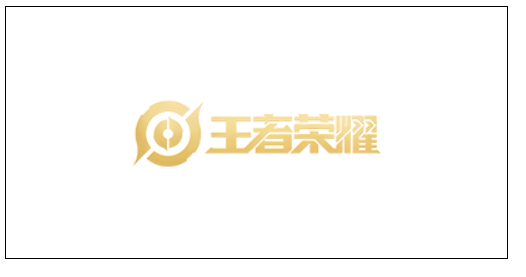
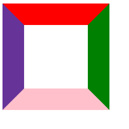
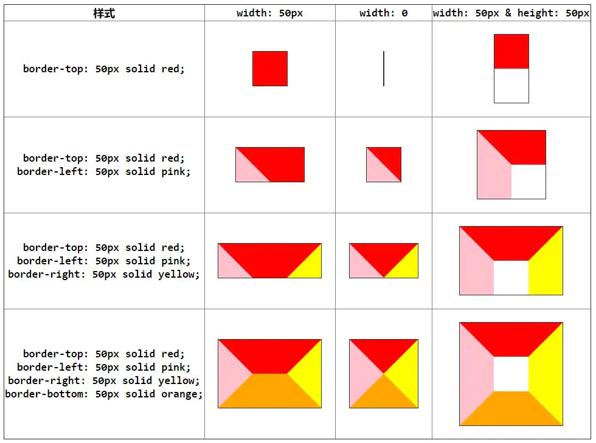
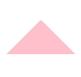
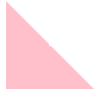
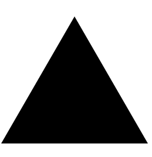

<!-- START doctoc generated TOC please keep comment here to allow auto update -->
<!-- DON'T EDIT THIS SECTION, INSTEAD RE-RUN doctoc TO UPDATE -->
**Table of Contents**  *generated with [DocToc](https://github.com/thlorenz/doctoc)*

- [css 基础知识](#css-%E5%9F%BA%E7%A1%80%E7%9F%A5%E8%AF%86)
  - [1. 盒模型](#1-%E7%9B%92%E6%A8%A1%E5%9E%8B)
    - [1. 内容区 - content](#1-%E5%86%85%E5%AE%B9%E5%8C%BA---content)
    - [2. 内边距（补白）- padding](#2-%E5%86%85%E8%BE%B9%E8%B7%9D%E8%A1%A5%E7%99%BD--padding)
    - [3. 边框 - border](#3-%E8%BE%B9%E6%A1%86---border)
    - [4. 外边距 - margin](#4-%E5%A4%96%E8%BE%B9%E8%B7%9D---margin)
  - [2. 选择器优先级](#2-%E9%80%89%E6%8B%A9%E5%99%A8%E4%BC%98%E5%85%88%E7%BA%A7)
  - [3. 垂直居中](#3-%E5%9E%82%E7%9B%B4%E5%B1%85%E4%B8%AD)
    - [1. 基于绝对定位的解决方案](#1-%E5%9F%BA%E4%BA%8E%E7%BB%9D%E5%AF%B9%E5%AE%9A%E4%BD%8D%E7%9A%84%E8%A7%A3%E5%86%B3%E6%96%B9%E6%A1%88)
    - [2. 基于 flex 的解决方案](#2-%E5%9F%BA%E4%BA%8E-flex-%E7%9A%84%E8%A7%A3%E5%86%B3%E6%96%B9%E6%A1%88)
    - [3. 文本的垂直居中](#3-%E6%96%87%E6%9C%AC%E7%9A%84%E5%9E%82%E7%9B%B4%E5%B1%85%E4%B8%AD)
  - [4. 水平居中](#4-%E6%B0%B4%E5%B9%B3%E5%B1%85%E4%B8%AD)
    - [1. 行内元素](#1-%E8%A1%8C%E5%86%85%E5%85%83%E7%B4%A0)
    - [2. 块级元素](#2-%E5%9D%97%E7%BA%A7%E5%85%83%E7%B4%A0)
    - [3. 使用 flex 布局](#3-%E4%BD%BF%E7%94%A8-flex-%E5%B8%83%E5%B1%80)
  - [5. 清除浮动](#5-%E6%B8%85%E9%99%A4%E6%B5%AE%E5%8A%A8)
    - [1. clear 属性](#1-clear-%E5%B1%9E%E6%80%A7)
    - [2. overflow 属性](#2-overflow-%E5%B1%9E%E6%80%A7)
    - [3. 伪元素](#3-%E4%BC%AA%E5%85%83%E7%B4%A0)
    - [4. 设置元素浮动后，该元素的 display 值是多少？](#4-%E8%AE%BE%E7%BD%AE%E5%85%83%E7%B4%A0%E6%B5%AE%E5%8A%A8%E5%90%8E%E8%AF%A5%E5%85%83%E7%B4%A0%E7%9A%84-display-%E5%80%BC%E6%98%AF%E5%A4%9A%E5%B0%91)
  - [6. BFC](#6-bfc)
  - [7. 常用单位](#7-%E5%B8%B8%E7%94%A8%E5%8D%95%E4%BD%8D)
    - [1. px](#1-px)
    - [2. em](#2-em)
    - [3. 百分比](#3-%E7%99%BE%E5%88%86%E6%AF%94)
    - [4. rem](#4-rem)
    - [5. vh](#5-vh)
    - [6. vw](#6-vw)
  - [8. 背景 - background](#8-%E8%83%8C%E6%99%AF---background)
    - [1. background-color](#1-background-color)
    - [2. background-image](#2-background-image)
    - [3. background-repeat](#3-background-repeat)
    - [4. background-position](#4-background-position)
    - [5. background-attachment](#5-background-attachment)
    - [6. 背景透明](#6-%E8%83%8C%E6%99%AF%E9%80%8F%E6%98%8E)
    - [7. background-size](#7-background-size)
    - [8. background-origin](#8-background-origin)
    - [9. background-clip](#9-background-clip)
    - [10. 背景属性的复合写法](#10-%E8%83%8C%E6%99%AF%E5%B1%9E%E6%80%A7%E7%9A%84%E5%A4%8D%E5%90%88%E5%86%99%E6%B3%95)
    - [11. 多背景图像](#11-%E5%A4%9A%E8%83%8C%E6%99%AF%E5%9B%BE%E5%83%8F)
  - [9. 字体 - font](#9-%E5%AD%97%E4%BD%93---font)
  - [10. 浮动 - float](#10-%E6%B5%AE%E5%8A%A8---float)
  - [11. 定位 - position](#11-%E5%AE%9A%E4%BD%8D---position)
    - [1. relative](#1-relative)
    - [2. absolute](#2-absolute)
    - [3. fixed](#3-fixed)
    - [4. 使用 absolute 模拟 fixed 定位效果](#4-%E4%BD%BF%E7%94%A8-absolute-%E6%A8%A1%E6%8B%9F-fixed-%E5%AE%9A%E4%BD%8D%E6%95%88%E6%9E%9C)
  - [12. 行内元素与块级元素](#12-%E8%A1%8C%E5%86%85%E5%85%83%E7%B4%A0%E4%B8%8E%E5%9D%97%E7%BA%A7%E5%85%83%E7%B4%A0)
  - [13. 元素的显示方式 - display](#13-%E5%85%83%E7%B4%A0%E7%9A%84%E6%98%BE%E7%A4%BA%E6%96%B9%E5%BC%8F---display)
    - [1. block](#1-block)
    - [2. inline](#2-inline)
    - [3. inline-block](#3-inline-block)
    - [4. flex](#4-flex)
    - [5. none](#5-none)
    - [6. `display: none;` 与 `visibility: hidden;` 的区别](#6-display-none-%E4%B8%8E-visibility-hidden-%E7%9A%84%E5%8C%BA%E5%88%AB)
  - [14. 元素的溢出属性 - overflow](#14-%E5%85%83%E7%B4%A0%E7%9A%84%E6%BA%A2%E5%87%BA%E5%B1%9E%E6%80%A7---overflow)
    - [1. scroll](#1-scroll)
    - [2. auto](#2-auto)
    - [3. visible](#3-visible)
    - [4. hidden](#4-hidden)
  - [15. 可继承的属性](#15-%E5%8F%AF%E7%BB%A7%E6%89%BF%E7%9A%84%E5%B1%9E%E6%80%A7)
  - [16. CSS 实现一个三角形](#16-css-%E5%AE%9E%E7%8E%B0%E4%B8%80%E4%B8%AA%E4%B8%89%E8%A7%92%E5%BD%A2)
  - [17. 使用 padding 与 margin 的时机](#17-%E4%BD%BF%E7%94%A8-padding-%E4%B8%8E-margin-%E7%9A%84%E6%97%B6%E6%9C%BA)
  - [18. 浏览器是怎样解析 CSS 选择器的？](#18-%E6%B5%8F%E8%A7%88%E5%99%A8%E6%98%AF%E6%80%8E%E6%A0%B7%E8%A7%A3%E6%9E%90-css-%E9%80%89%E6%8B%A9%E5%99%A8%E7%9A%84)
  - [19. 如果需要手动写动画，你认为最小时间间隔是多久，为什么？](#19-%E5%A6%82%E6%9E%9C%E9%9C%80%E8%A6%81%E6%89%8B%E5%8A%A8%E5%86%99%E5%8A%A8%E7%94%BB%E4%BD%A0%E8%AE%A4%E4%B8%BA%E6%9C%80%E5%B0%8F%E6%97%B6%E9%97%B4%E9%97%B4%E9%9A%94%E6%98%AF%E5%A4%9A%E4%B9%85%E4%B8%BA%E4%BB%80%E4%B9%88)
  - [20. CSS 引入的方式有哪些？使用 `Link` 和 `@import` 有什么区别](#20-css-%E5%BC%95%E5%85%A5%E7%9A%84%E6%96%B9%E5%BC%8F%E6%9C%89%E5%93%AA%E4%BA%9B%E4%BD%BF%E7%94%A8-link-%E5%92%8C-import-%E6%9C%89%E4%BB%80%E4%B9%88%E5%8C%BA%E5%88%AB)

<!-- END doctoc generated TOC please keep comment here to allow auto update -->

# css 基础知识

## 1. 盒模型

### 1. 内容区 - content

### 2. 内边距（补白）- padding

### 3. 边框 - border

### 4. 外边距 - margin

## 2. 选择器优先级

## 3. 垂直居中

### 1. 基于绝对定位的解决方案

1. html结构是：
   ```html
   <body>
       <main>
           <h1>Am I centered yet?</h1>
           <p>Center me, please!</p>
       </main>
   </body>

   ```
2. 元素具有固定宽高  
   - css样式：
      ```css
           main {
              position: absolute;
              top: 50%;
              left: 50%;
              /*自身宽度的一半*/
              margin-left: -9em;
              /*自身高度的一半*/
              margin-top: -5em;
              width: 18em;
              height: 10em;
              background: #c7254e;
        
           }
      ```
   - 使用calc()函数，省去写margin-left和margin-top。
     ```css
        main {
          position: absolute;
          top: calc(50% - 5em);
          left: calc(50% - 9em);
          width: 18em;
          height: 10em;
          background: #c7254e;

        }
     ```
3. 元素没有固定宽高  
   - 使用 css3 中新添加的 tranlate() 函数，。这个函数使用百分比值时，是以这个元素自身的宽度和高度为基准进行换算和移动的。这样就不需要我们指定元素的宽高了。
     ```css
         main {
          position: absolute;
          top: 50%;
          left: 50%;
          transform: translate(-50%);
          background: #c7254e;

         }
     ```
### 2. 基于 flex 的解决方案

1. html结构是：
   ```html
      <div class="container">
         <div class="center"></div>
      </div>
   ```
2. css样式为：
   ```css
      .container {
         display: flex;
         align-items: center;
      }
   ```
### 3. 文本的垂直居中

1. 单行文本
   - 对于单行文本，我们只需要将文本行高 `line-height` 和所在区域高度 `height` 设为一致即可。
   - 原理：行高 `line-height` 由三部分组成：上空隙、文字本身高度和下空隙组成。如下图所示：  
   
   - 那么单行文本垂直居中，原理就好理解了：  
   行高的上空隙和下空隙把文字挤到中间，如果行高小于盒子高度，文字就会偏上，如果行高大于盒子高度，文字则偏下。图示如下：  
   
   - html结构如下：
     ```html
        <div class="test">这是一行</div>
     ```
   - css样式如下：
     ```css
        .test {
            width: 35px;
            height: 40px;
            text-align: center;
            /*文本行高 line-height 和所在区域高度 height 一致，文本即可垂直居中*/
            line-height: 40px;
         }
     ```
2. 多行文本
   1. 父级元素高度不固定，随着内容变化
      - 解决方法：父级高度不固定的时，高度只能通过内部文本来撑开。这样，我们可以通过设置内填充 padding 的值来使文本看起来垂直居中，只需设置 padding-top 和 padding-bottom 的值相等。
      - html结构：
        ```css
           <div id="div1">
               这是多行文本垂直居中，
               这是多行文本垂直居中，
               这是多行文本垂直居中，
               这是多行文本垂直居中。
           </div>
        ```
      - css结构：
        ```css
           #div1 {
               width: 300px;
               border: 1px solid red;
               margin: 50px auto;
               text-align: center;
               padding: 35px 20px;
           }
         ```
   2. 父级元素高度不固定，随着内容变化
      - css 中的 vertical-align 属性，但是它只对拥有 valign 特性的元素才生效（div、span 不具有 valign 特性），结合`display: table;`，可以使得 div 模拟 table 属性。因此我们可以设置父级 div 的 displa y属性：`display: table;`；然后再添加一个 div 包含文本内容，设置其`display:table-cell;`和`vertical-align:middle;`。
      - html代码：
        ```html
           <div class="container">
               <div id="div2">
                   这是多行文本垂直居中，
                   这是多行文本垂直居中，
                   这是多行文本垂直居中，
                   这是多行文本垂直居中。
               </div>
           </div>
        ```
      - css代码：
        ```css
           /*元素具有固定的宽高，设置多行文本垂直居中*/
            .container {
                width: 400px;
                height: 200px;
                margin: 50px auto;
                border: 1px solid red;
                /*外层元素的display属性设置为table，这样可以使用vertical-align（垂直对齐）属性*/
                display: table;
            }
            .container #div2 {
                width: 100%;
                /*内层元素display属性设置为table-cell，表示这是表格的单元格*/
                display: table-cell;
                /*设置vertical-align（垂直对齐）为middle，则可设置文本垂直居中*/
                vertical-align: middle;
                text-align: center;
            }
        ```
## 4. 水平居中

### 1. 行内元素

1. css 样式：`text-align: center;`

### 2. 块级元素

1. css 样式：`margin： 0 auto;`

### 3. 使用 flex 布局

1. html 结构：
   ```html
      <div class="container">
         <div class="center">水平居中</div>
      </div>
   ```
2. css 样式：
   ```css
      .container {
         display: flex;
         display-direction: row;
         justify-content: center;
      }
   ```
## 5. 清除浮动

### 1. clear 属性

1. 在最后一个浮动标签后，新加一个标签，设置其 `clear` 属性。
1. css 样式：`clear: left/right/both;`

### 2. overflow 属性

1. 给父元素添加 `overflow` 属性。
1. css 样式：`overflow: hidden;`

### 3. 伪元素

1. 使用伪元素清除浮动。

2. css 样式
   ```css
      .clearfix::after{
           /* 伪元素是行内元素，正常浏览器清除浮动方法 */
           content: "";
           dispaly: block;
           height: 0;
           clear: both;
           visibility: hiden;
      }
   ```
   clearfix 是包含浮动元素的的父元素。

### 4. 设置元素浮动后，该元素的 display 值是多少？

1. 自动变成 `display:block;`

## 6. BFC

## 7. 常用单位

### 1. px

1. 参考资料
   - [设备像素，CSS像素，设备独立像素](https://segmentfault.com/a/1190000015884091)

2. css 像素
   > css像素是 **web编程的概念** ，它是 **抽象的** ，实际上 **不存在** 。用于逻辑上衡量像素的单位。也就是我们做网页时用到的 css 像素单位。 

3. 设备像素（device pixel，DP）
   > 设备像素又称 **物理像素** ，是设备能控制显示的最小单位，我们可以把它看做显示器上的一个点。我们常说的 1920x1080 像素分辨率就是用的设备像素单位。
   - 我的理解，物理像素，就是我们常说的某某屏幕的分辨率。就是设备的屏幕上最小的一个发光单元，显示单位。没有固定大小，比如不同尺寸的显示器，不同尺寸的手机，分辨率都可能是 1920 × 1080 的。

4. 设备独立像素（Device Independent Pixel，DIP）
   > 设备独立像素也叫密度无关像素 ，可以认为是计算机坐标系统中的一个点，这个点表示一个可以由程序使用并控制的虚拟像素，可以由相关系统转换为物理像素。设备独立像素是一个整体概念，包括了 css 像素，比如:css 像素，只是在 android 机中，css像素不叫 “css像素了”，而叫“设备独立像素”。

5. 在不同屏幕上，css 像素呈现的物理尺寸一致，就是一个 css 像素的大小是固定的。在不同设备下，css 像素对应的物理像素具数不同：
   - 在 PC 端，默认情况下，CSS 像素是和物理像素保持一致的，即：1个单位的CSS像素 = 1个单位的物理像素。
   - 在移动端，依据设备而定。

6. 设备像素和设备独立像素之间的关系是由 PPI 和 DRP 决定的。

7. PPI 是每英寸的像素数（pixel per inch）的缩写。这里不多说。

8. DRP 是设备像素比（ device pixel ratio）的缩写。设备像素比定义了设备像素和设备独立像素的转换关系(告诉你一个设备像素对应多少个独立设备像素(既css像素))，计算式为： 
`DPR = 设备像素 / 设备独立像素`

9. 在 javascript 中，可以通过 `window.devicePixelRatio` 获取到当前设备的dpr。在 css 中，可以通过 `-webkit-device-pixel-ratio`，`webkit-min-device-pixel-ratio` 和 `-webkit-max-device-pixel-ratio`进行媒体查询，对不同 dpr 的设备，做一些样式适配(这里只针对webkit内核的浏览器和webview)。

10. 设备像素是固定大小不变的，而设备独立像素是大小可变的。二者并不是严格的1比1关系。

11. 那么对于设备像素，是如何与设备独立像素进行换算呢，这时前面定义的 PPI 和 DPR 就派上用途了。先举个例子：
    - 以 iphone 6 为例，设备宽高为 375 × 667，可以理解为设备独立像素(或css像素)。DPR为 2，根据上面的计算公式，其物理像素就应该 × 2，为750 × 1334，这个物理像素就是 iphone 6 的分辨率。
    - 同样的 css 像素，不同的设备，对应的设备像素如下：
      
    - 两个设备的物理像素是不同的，但是设置了同样的 css 像素，在视觉显示上，物理尺寸是一致的。CSS 像素同样是 2 × 2，但是二者对应的物理像素是不一致的，第一个设备的物理像素是 2 × 2，第二个设备的物理像素是 4 × 4。 

12. 我们以 PPI 作为设备像素密度的分界，获得默认缩放比例，即设备像素比。如下图所示：
     
     
13. 获得设备像素比后，便可得知设备像素与 CSS 像素之间的比例。当这个比率为1:1时，使用1个设备像素显示1个 CSS 像素。当这个比率为 2:1 时，使用4个设备像素显示 1 个 CSS 像素，当这个比率为 3:1 时，使用 9（3*3）个设备像素显示 1 个 CSS 像素。
### 2. em

1. 相对单位
2. 相对于父元素字体的大小

### 3. 百分比

### 4. rem

1. 参考资料
   - [Rem布局的原理解析](https://zhuanlan.zhihu.com/p/30413803)
   - [移动端Web页面适配方案（整理版）](https://www.jianshu.com/p/2c33921d5a68)
   - [第三代移动端布局方案](https://segmentfault.com/a/1190000018850370)
   - [移动端布局方案浅谈](https://segmentfault.com/a/1190000010412860)

2. rem 是 css3 新增的一个单位，也是一个相对单位，常用于移动端布局。

3. 1rem  = 根元素，即 html 节点的字体大小。这样页面中，元素的大小，就有了一个统一的参考，如果根元素字体的大小发生了变化，那么元素的大小也会发生变化。这样就能根据不同移动设备的宽度对页面进行动态调整。通过 js 获取当前页面的宽度，动态计算根元素字体的大小。

4. 使用 rem 进行移动布局的原理：基于宽度的等比例缩放。

5. 下面的内容引用自  [Rem布局的原理解析](https://zhuanlan.zhihu.com/p/30413803)：
   > 其实rem布局的本质是等比缩放，一般是基于宽度，试想一下如果UE图能够等比缩放，那该多么美好啊
     假设我们将屏幕宽度平均分成100份，每一份的宽度用x表示，x = 屏幕宽度 / 100，如果将x作为单位，x前面的数值就代表屏幕宽度的百分比：
     `p {width: 50x} /* 屏幕宽度的50% */` 
     如果想要页面元素随着屏幕宽度等比变化，我们需要上面的x单位，不幸的是css中并没有这样的单位，幸运的是在css中有rem，通过rem这个桥梁，可以实现神奇的x。
   > 通过上面对rem的介绍，可以发现，如果子元素设置rem单位的属性，通过更改html元素的字体大小，就可以让子元素实际大小发生变化 
   >   ```
   >    html {font-size: 16px}
   >    p {width: 2rem} /* 32px*/
   > 
   >    html {font-size: 32px}
   >    p {width: 2rem} /*64px*/
   >   ```
   > 如果让html元素字体的大小，恒等于屏幕宽度的1/100，那1rem和1x就等价了。
   >   ```
   >      html {fons-size: width / 100}
   >      p {width: 50rem} /* 50rem = 50x = 屏幕宽度的50% */ 
   >  ```
   >如何让html字体大小一直等于屏幕宽度的百分之一呢？ 可以通过js来设置，一般需要在页面dom ready、resize和屏幕旋转中设置：`document.documentElement.style.fontSize = document.documentElement.clientWidth / 100 + 'px'; `
那么如何把UE图中的获取的像素单位的值，转换为已rem为单位的值呢？公式是元素宽度 / UE图宽度 * 100，让我们举个例子，假设UE图尺寸是640px，UE图中的一个元素宽度是100px，根据公式100/640*100 = 15.62
`p {width: 15.625rem}`

### 5. vh

### 6. vw

## 8. 背景 - background

### 1. background-color

1. 设置元素的背景颜色。属性值可以是颜色关键字、十六进制颜色代码、rgb() 或hls()。默认值是 transparent，即透明。

### 2. background-image

1. 用途：常见于logo或者装饰性的小图片，或者超大的背景图片。优点是非常便于控制位置。

2. 语法：
   - `background-image: url(图片路径);`
   
3. 参数说明：
   - none：无背景图片（默认值）
   - url()：使用绝对路径或相对路径指定的背景图片
   
### 3. background-repeat

1. 控制背景图片是否重复。

2. 语法：
   - `background-repeat: repeat|no-repeat|repeat-x|repeat-y;`
   
### 4. background-position

1. 改变图片在背景中的位置。

2. 语法：
   - `background-position: x y;`
   
3. x和y表示横纵坐标，可选的值如下：
   - length：百分数|由浮点数和单位标识组成的长度值
   - position：方位名词，水平方向是：left | center | right。垂直方向是：top | center | bottom。
   
4. 参数说明：
   1. 方位名词：
      - 应用的是对齐规则，而不是坐标规则。x 为 left 表示图像的左边与元素的左边对齐，为 right 表示图像的右边和元素的右边对齐，为 center 表示图像的水平方向的中点和元素水平方向的中点对齐；y 为 top 表示图像的顶部和元素的顶部对齐，为 bottom 表示图像的底部和对象的底部对齐，为 center 表示图像的垂直方向的中点和垂直水平方向的中点对齐。
      - 方位名词与顺序无关。也就是`background-position: left top;`与`background-position: top left;`效果相同。
      - 如果只指定了一个方位名词，另外一个值省略，则第二值默认是center。
      - 使用方位名词对背景图片进行定位：
        - css样式：
          ```css
             div.test {
                width: 400px;
                height: 200px;
                border: 1px solid black;
                background-image: url(../media/logo.png);
                background-repeat: no-repeat;
                
                background-position: center center;
             }
          ```
        - 图示：
        
   2. 百分数
      - 是将图像本身（x%, y%）的那个点，与背景区域的（x%, y%）的那个点重合。最终得到背景图像起始位置坐标的计算公式为：  
      **x = (对象的宽度 - 图像的宽度) * x% ;**  
      **y = (对象的高度 - 图像的高度) * y% ;**  
      例如：`background-position: 75% 50%;`，那么背景图片的最终位置如下图所示：  
      
      - 例如，设置background-position为50% 50%。则x和y坐标分别是：  
      x = (400 - 200) * 50% = 100px;  
      y = (200 - 54) * 50% = 73px;  
      也是达到了方位名词center center的效果。
      - 百分数还可以是负值。计算规则同上。例如，设置background-position为-20% -10%。则x和y坐标是：  
      x = (400 - 200) * (-20%) = -40px;  
      y = (200 - 54) * (-10%) = -14.6px;    
      x和y坐标均为负值，则背景图片有一部分在元素之外，所以只显示在元素之内的背景图片的部分。
      - 使用负的百分数对背景图片进行定位：
        - css样式：
          ```css
             div.test {
                width: 400px;
                height: 200px;
                border: 1px solid black;
                background-image: url(../media/logo.png);
                background-repeat: no-repeat;
                /*使用负百分数*/
                background-position: -20% -10%;
             }
           ```
        - 图示：  
        
   3. 长度值
      - 表示使用长度值定位，是将背景图像的左上角，放置在对象的背景区域中（x, y）所指定的位置，即 x, y 定义的是背景图像的左上角，相对于背景区域左上角的偏移量。
      - 偏移量长度可以是正值，也可以是负值。x 为正值表示向右偏移，负值表示向左偏移；y 为正值表示向下偏移，负值表示向上偏移。背景图像发生移动后，就有可能超出对象的背景区域。此时，超出的部分将不会显示，只会显示落入背景区域的部分。
      - 使用长度值对背景图片进行定位：
      - 长度值为正值：
        - css样式：
          ```css
             .test {
                width: 400px;
                height: 200px;
                border: 1px solid black;
                background-image: url(../media/logo.png);
                background-repeat: no-repeat;
                /* x, y 定义的是背景图像的左上角，相对于背景区域左上角的偏移量。*/
                background-position: 100px 73px;
                
             }
          ```
        - 图示：
          
        效果同`background-position: center center;`相同。
      - 长度值为负值：
        - css样式：
          ```css
             .test {
                width: 400px;
                height: 200px;
                border: 1px solid black;
                background-image: url(../media/logo.png);
                background-repeat: no-repeat;
                background-color: #666;
                /* x, y 定义的是背景图像的左上角，相对于背景区域左上角的偏移量。*/
                background-position: -100px 0px;
                      
             }
           ```
        - 图示：
            
          背景图片向左移动，有一部分超出了元素的范围，因此不会被显示。  
            
5. 参考文献：[CSS 背景位置 background-position属性](https://blog.csdn.net/ixygj197875/article/details/79333151)

6. 方位名词和长度（包含长度值和百分数）可以混合，则第一个值是x坐标，第二个值是y坐标。

### 5. background-attachment

1. 这个属性设置背景图像是否固定或者随着页面其余部分滚动。

2. 用途：可以做一些视察滚动效果。

3. 语法：
   - `background-attachment: scroll|fixed;`
   
4. 参数说明：
   - scroll：背景图片随着对象内容滚动（默认值）
   - fixed： 背景图片固定
   
### 6. 背景透明

1. css3为我们提供了背景颜色半透明的效果。

2. 语法：
   - `background: rgba(0, 0, 0, 0.3);`
   
3. 参数说明：
   - 前三个参数代表 red、green、blue，取值范围是 0~255。
   - 最后一个参数是alpha，表示透明度。取值范围是 0~1。0表示透明，1 表示不透明。
   
4. 背景透明指的是盒子背景半透明，盒子中的内容不受影响。

5. 背景透明实例：
   - css样式：
     ```css
        .test {
           width: 300px;
           height: 200px;
           font-size: 30px;
           background: rgba(0, 0, 0, 0.5);
        }
     ```
   - 图示：  
     
   rgb(0, 0, 0)表示白色，加上0.5的alpha值，就变成了上图的样子了。
   
### 7. background-size

1. css3新增属性，用来指定背景图片的大小。非常好用。

2. 语法：
   - `background-size: auto||length||percentage||cover||contain ;`
   
3. 参数说明：
   - auto：默认值，将保持图片的原始高度和宽度。
   - length：取具体的整数值，单位是px，将改变背景图片的大小。
   - percentage：取值为百分数，可以是0%~100%。也会改变背景图片的宽度和高度。**注意**：这个百分数是相对于元素的宽度计算的，并不是根据背景图片的宽度来计算。即：  
     - 图片的实际宽度 = 百分数 * 元素宽度  
     - 图片的实际高度 = 百分数 * 元素高度  
   
   - cover：将背景图片放大，以适合铺满整个容器。但是可能会造成图片的失真。
   - contain：保持背景图片本身的宽高比例，将背景图像压缩到宽度或者高度正好适应所定义的背景容器的区域。
   
4. 当 background-size 取值为固定值（length）和百分数（percentage）时，可以设置两个值，分别指定图片的宽度和高度。只取一个值时，指定了背景图片的宽度，第二种相当于 auto。也就是指定了宽度。在这种情况下，auto 值设定之后，能够让背景图片的高度自动的按照比例缩放。  
**注意：**当元素有 padding 的时候，使用百分数指定背景图片的尺寸时，要记得加上这个内边距，再进行计算。

5. `background-size: cover;` 配合 `background-position: center;` 常常用来制作满屏背景效果。唯一的缺点是，需要一张足够大的背景图片，不然在较高分辨率的浏览器下图片会失真。

6. background-size的应用：
   - 在流体布局或者响应式布局中，确保背景图像能够始终适应容器大小。
   - 对于平铺重复性背景图像，可以保证背景图像不会有截断效果。
   - 在流体布局中缩放背景图像来伪造多列分栏效果。
   - 解决Retina屏幕双倍像素下背景图像模糊的问题。
   - 使用链接或者列表元素的背景图像能够和文本一起进行缩放。
   
7. 示例（下面使用的背景图片分辨率是100×100）：
   1. 设置为auto
      - css样式：
        ```css
          .test {
              width: 320px;
              height: 270px;
              /*font-size: 30px;*/
              border: 6px dashed black;
              background-image: url(../media/logo-3_small.jpg);
              background-repeat: no-repeat;
        
              /*设置背景图片尺寸为auto，则背景图片会保持原来的尺寸不变*/
              background-size: auto;
           }
        ```
      - 图示：
        
      图片的原始分辨率为100×100，background-size设置为auto，背景图像保持原来的尺寸大小不变。
   2. 设置为 percentage
     - css样式：
       ```css
          .test {
              width: 320px;
              height: 270px;
          
              border: 6px dashed black;
              background-image: url(../media/logo-3_small.jpg);
              background-repeat: no-repeat;
               /*使用百分数指定宽度和高度*/
               /*注意，百分数是相对于元素的宽高而言的，则图片的实际宽度是：50% * 320 = 160px，
               实际高度是：80% * 270 = 216px*/
               background-size: 50% 80%;
               /*百分数也可以取一个值，表示指定了宽度，而高度自动设置为auto*/
               /*实际的高度值会按照图片的原始比例结合实际宽度计算出来*/
                /*background-size: 60%;*/
          
          }
       ```
     - 图示：  
       
   3. 设置为 length
      - css样式：
        ```css
           .test {
              width: 320px;
              height: 270px;
              border: 6px dashed black;
              background-image: url(../media/logo-3_small.jpg);
           
              background-repeat: no-repeat;
           
           
              /*显式的指定背景图片的宽度和高度，这样可能会拉伸图片造成图片的失真*/
              background-size: 280px 200px;
              /*指定一个值，这个值会被作为宽度，而高度会被设置为auto，相当于：280px auto*/
              /*实际的高度值会按照图片的原始比例结合实际宽度计算出来*/
              /*background-size: 280px;*/
           
           }
        ```
      - 图示：  
        
      直接指定长度，有可能造成背景图片的失真。
   4. 设置为 cover
      - css样式：
        ```css
           .test {
              width: 320px;
              height: 270px;
              border: 6px dashed black;
              background-image: url(../media/logo-3_small.jpg);
              
              background-repeat: no-repeat;
              /*有一个细节，就是背景图片放大以后，图片并没有在正中间，为了让图片放大后再正中间显示
                          我们需要设置background-position为center*/
              background-position: center;
              /*将背景图片放大，以适合铺满整个容器*/
              background-size: cover;
              
           }
        ```
      - 图示：  
         
   5. 设置为 contain
      - css样式：
        ```css
           .test {
              width: 320px;
              height: 270px;
              border: 6px dashed black;
              background-image: url(../media/logo-3_small.jpg);
                 
              background-repeat: no-repeat;
              
              /*以最小值为标准，也就是如果元素高度最小，那么图片的实际高度就是元素高度，然后图片的实际宽度，就是按照比例计算出来的，可能出现不会填满整个元素的情况*/
              background-size: contain;
                 
           }
        ```
      - 图示：  
         
      background-size 设置为c ontain，则背景图片在保持原有比例的前提下，尽量铺满元素。  
      
### 8. background-origin

1. css3新增属性，用来设置background-position属性的参考原点。即决定背景图片的定位的起点。默认情况下，定位的原点是元素的左上角。

2. 使用background-origin属性，可以根据自己的需求任意改变背景图片的background-position的起始位置。

3. 语法：
   - `background-origin: padding-box || border-box || content-box;`
   
4. 参数说明：
   - padding-box：默认值，决定 background-position 的起始位置从padding的外边缘（border的外边缘）开始显示背景图片。
   - border-box：决定 background-position 的起始位置从 border 的外边缘开始显示背景图片。
   - content-box:决定 background-position 的起始位置从 content 的外边缘（border的内边缘）开始显示背景图片。
   
### 9. background-clip

1. css3新增属性，用来定义背景图片的剪裁区域，与background-origin属性类似。
2. 语法：
   - `background-clip: border-box || padding-box || content-box;`
   
3. 参数说明：
   - border-box：默认值，元素背景图片从元素的 border 区域向外剪裁，即元素边框之外的背景图片都会被剪裁掉。
   - padding-box：默认值，元素背景图片从元素的 border 区域向外剪裁，即元素边框之外的背景图片都会被剪裁掉。
   - content-box：默认值，元素背景图片从元素的 content 区域向外剪裁，即元素内容区域之外的背景图片都会被剪裁掉。
   
### 10. 背景属性的复合写法

1. 合写顺序是：

   - `background: color url() repeat attachment position;`
2.background-size、background-origin和background-clip应该单独写出来。
   - **注意**，background-position和background-size可以合写，前面是position，后面是size，中间使用斜杆（/）划分。例如：center/cover。

### 11. 多背景图像

1. 给同一个元素设置多个背景图片。在 css的 background-image 或者 background属性中列出需要使用的所有背景图像，使用逗号隔开。而且每一张图片具有background 中的属性。

2. 语法：
   - `background: url() no-repeat 0px 0px, url() no-repeat 50% 50%; `

## 9. 字体 - font

## 10. 浮动 - float

## 11. 定位 - position

### 1. relative

1. 基于自身原本出现的位置进行定位。

2. 不脱离文档流。

3. 可以设置 `top`、`bottom`、`left` 和 `right`。

### 2. absolute

1. 基于父级元素中第一个非 `static` 定位的元素的位置进行定位。

2. 脱离文档流。

3. 如果父级元素都是 `static`，则设置了 `absolute` 的定位的元素是基于 `body` 元素定位。

4. 可以设置 `top`、`bottom`、`left` 和 `right`。

5. 可以用于设置元素的水平垂直居中。

### 3. fixed

1. 将元素固定在窗口的某个位置。

2. 元素脱离文档流。

3. 基于窗口位置进行定位，

4. 可以设置 `top`、`bottom`、`left` 和 `right`。

5. 不能对设置了 `fix` 定位的元素应用 2D 形变 —— `transform` 属性。

### 4. 使用 absolute 模拟 fixed 定位效果

1. 参考资料
   - [使用absolute模拟fixed定位，兼容ie6，及ie7 8 9和火狐谷歌等浏览器](https://www.cnblogs.com/k13web/p/4139384.html)
   - [absolute模拟fixed效果（解决fixed失效问题）](https://blog.csdn.net/longyin0528/article/details/80777809)

2. html 结构：
   ```html
      <div class="test-1"></div>
      <div class="fixed"></div>
   ```

3. css 样式：
   ```css
      html {
            /*overflow: scroll;*/
            overflow: hidden;
            height: 100%;
        }

        body {
            overflow: scroll;
            height: 100%;
        }

        .test-1 {
            height: 1000px;
            background-color: rebeccapurple;
        }

        .fixed {
            position: absolute;
            left: 50px;
            top: 50px;
            height: 100px;
            width: 100px;
            background-color: greenyellow;
        }
   ```

4. 原理：
   1. 对 html 或 body 其中一个节点设置 `overflow: scroll;`，那么都会会应用到 document 上， 即只出现一个滚动条。
   2. 对 body 和 html 同时设置 `overflow: scroll;`，那么会出现两个滚动条，其中 html 设置的 `overflow` 属性应用到 document 上，而 body 的 `overflow` 属性应用到自身上。
   3. 默认 html 和 body 高度随内容而变化，当 html 的 `height` 设置 100%，设置了  `overflow: scroll;` 则超出的部分隐藏。则文档大小只有一屏高度，超出部分不会显示，也没有滚动条。这样就相当于将 body 元素固定了，没有滚动条可以移动 body。
   4. body 是内容区，将 body 的 `height` 设置为 100%，同时设置了  `overflow: scroll;`则内容超出后自动产生滚动条。这样内容超出后出现的滚动条是 body 的，模拟了默认浏览器出现的滚动条。 
   5. 对于设置绝对定位的元素而言，其定位的坐标是第一个非 static 定位的父级元素，如果没有这样的父级元素，那么定位就是相对于 body 元素而言。
   6. 对于 fixed 元素进行绝对定位后是相对于整个浏览器可视区域的 `0 0` 坐标为基准，而内容超出后是以 body 为基准出现滚动条，且 body 高度已经设置成和可视区域高度相同。所以即使拖拽滚动条，进行绝对定位的元素位置也不会变。
   7. 必须将 html 和 body 的 `padding` 和 `margin` 值清零，否则会出现不能填满浏览器的现象，且 `html` 和 `body` 不能设宽度，即使设置`width: 100%` 也会出问题，ie6 右边会有一部分空白无法填满浏览器。
 
 5. 总结：设置 html 的 overflow 属性为 hidden，禁止了 body 元素出现滚动。同时让 body 元素充满整个窗口。则相对于 body 元素进行绝对定位的元素就不会移动了。后面即使出现滚动条，也是 body 下的其他元素的。

## 12. 行内元素与块级元素

1. 块级元素的 display 属性为 block，具备如下特性：
   - 可以设置宽高
   - 文档流中独占一行
   - 外边距设置生效

2. 常见的块级元素：
   - 网页、框架等基本结构块：html、body、iframe
   - 网页标题块：title
   - 表单结构块：form、fieldset、legend
   - 布局结构块：div
   - 标题段落结构块：h1~h6、p
   - 列表结构块：dl、dt、dd、ul、ol
   - 结构装饰块：hr

3. 行内元素的 display 属性为 inline，具备如下特性：
   - 默认由内容撑开宽高，与其他行元素能够处在同一行
   - 不能够设置宽高（换句话说，设置宽高也无效）
   - 纵向外边距失效，横向外边距生效

4. 常见的行内元素：
   - 行内包含框：span
   - 超链接：a
   - 图像：img
   - 各类文本修饰类标签：abbr、acronym、b、bdo、big、cite、code、del、dfn、em、i、ins、kbn、q、s、samp、small、strike、strong、sub、sup、tt、u、var等
   - 表单对象包含框：select、button、label、textarea
   - 可执行对象包含框：object


## 13. 元素的显示方式 - display

### 1. block

1. 块级元素的默认属性值。

2. 可以将一个元素设置为块级元素。 

3. 设置这个属性值以后，元素具备块级元素的特性。

### 2. inline

1. 行内元素的默认属性值。

2. 可以将一个元素设置为行内元素。 

3. 设置这个属性值以后，元素具备行内元素的特性。

### 3. inline-block

1. 将元素编程行内的块级元素。

2. 与其他元素能处在同一行。

3. 可以设置元素的宽高。

### 4. flex

1. 将这个元素（容器）设置为 flex 布局，该元素内部的项目按照 flex 布局的方式进行布局。

### 5. none

1. 用于隐藏元素。
2. 设置了这个属性值以后，元素不会在文档流中出现。

### 6. `display: none;` 与 `visibility: hidden;` 的区别

1. 二者都是用于将元素隐藏。

2. `display: none;` 不仅将元素隐藏，而且在文档流中不会出现这个元素，因此不会占据页面中的位置。

3. `visibility: hidden;` 仅仅是将元素隐藏，在视觉上看不见，但是依然会出现在文档流中。页面中也会保留其占据的位置。

## 14. 元素的溢出属性 - overflow

### 1. scroll

1. 参数是 scroll 时候，必会出现滚动条。

### 2. auto

1. 参数是 auto 时候，子元素内容大于父元素时出现滚动条。

### 3. visible

1. 参数是 visible 时候，溢出的内容出现在父元素之外。

### 4. hidden

1. 参数是 hidden 时候，溢出隐藏。

2. 可以触发元素的 BFC。

## 15. 可继承的属性

1. 每一个属性在定义中都给出了这个属性是否具有继承性，一个具有继承性的属性会在没有指定值的时候，会使用父元素的同属性的值来作为自己的值。

2. 字体相关的属性，`font-size` 和 `font-weight` 等。

3. 文本相关的属性，`color` 和 `text-align` 等。

4. 表格的一些布局属性、列表属性如 `list-style` 等。

5. 光标属性 `cursor`、元素可见性 `visibility`。

6. 当一个属性不是继承属性的时候，我们也可以通过将它的值设置为 `inherit`来使它从父元素那获取同名的属性值来继承。

## 16. CSS 实现一个三角形

1. 原理：相邻的 border 是以某个角度为分隔的（夹角之和为 90 度），如下图所示：
   

2. 更详细的说明如下图所示：
   

3. border 与不同的 width：
   

4. 设置元素的宽高均为 0，然后将 border 设置的宽一些，根据需要，将不同方向的 border 的颜色设置为 transparent（透明）。

5. 示例 - 基础的三角形
   ```css
      .content {
          width: 0px;
          border-top: 35px transparent solid;
          border-right: 35px transparent solid;
          border-bottom: 35px pink solid;
          border-left: 35px transparent solid;
      }
   ```
   效果：
   

6. 示例 - 直角三角形
   ```css
      .content {
          width: 0px;
          border-top: 35px transparent solid;
          border-right: 35px transparent solid;
          border-bottom: 35px pink solid;
          border-left: 35px pink solid;
      }
   ```
   效果：
   

7. 示例 - 等边三角形
   - 显示部分的宽度 = transparent部分的宽度 * √3
   - css 代码：
     ```css
        .content {
          width: 0px;
          border-top: 35px transparent solid;
          border-right: 35px transparent solid;
          border-bottom: 35px pink solid;
          border-left: 35px pink solid;
      }
     ```
   - 效果：
     


## 17. 使用 padding 与 margin 的时机

1. 何时应当使用margin
   - 需要在 border 外侧添加空白时。
   - 空白处不需要背景（色）时。
   - 上下相连的两个盒子之间的空白，需要相互抵消时。如 15px + 20px 的margin，将得到 20px 的空白。

2. 何时应当时用padding
   - 需要在 border 内测添加空白时。
   - 空白处需要背景（色）时。
   - 上下相连的两个盒子之间的空白，希望等于两者之和时。如 15px + 20px 的 padding，将得到 35px 的空白。


## 18. 浏览器是怎样解析 CSS 选择器的？

1. CSS选择器的解析是从右向左解析的，为了避免对所有元素进行遍历。若从左向右的匹配，发现不符合规则，需要进行回溯，会损失很多性能。若从右向左匹配，先找到所有的最右节点，对于每一个节点，向上寻找其父节点直到找到根元素或满足条件的匹配规则，则结束这个分支的遍历。两种匹配规则的性能差别很大，是因为从右向左的匹配在第一步就筛选掉了大量的不符合条件的最右节点（叶子节点），而从左向右的匹配规则的性能都浪费在了失败的查找上面。

2. 在 CSS 解析完毕后，需要将解析的结果与 DOM Tree 的内容一起进行分析建立一棵 Render Tree，最终用来进行绘图。在建立 Render Tree 时（WebKit 中的「Attachment」过程），浏览器就要为每个 DOM Tree 中的元素根据 CSS 的解析结果（Style Rules）来确定生成怎样的 Render Tree。

## 19. 如果需要手动写动画，你认为最小时间间隔是多久，为什么？

1. 多数显示器默认频率是 60Hz，即 1 秒刷新 60 次，所以理论上最小间隔为 1/60＊1000ms ＝ 16.7ms。

## 20. CSS 引入的方式有哪些？使用 `Link` 和 `@import` 有什么区别

1. 引入的方式
   - 内联：标签的 `style` 属性
   - 内嵌：`<style></style>`
   - 外链: `<link rel="stylesheet" href="">`
   - 导入: `@import`

2.  `Link` 和 `@import` 的区别
    - 作用上：`link` 属于 XHTML 标签，除了加载 CSS 外，还能用于定义 RSS，定义 rel 连接属性等作用，无兼容性，支持使用 javascript 改变样式；而 `@import` 是 CSS 提供的，只能用于加载 CSS，不支持使用 javascript 改变样式。

   - 加载顺序上：页面被加载的时，`link` 会被同时加载，而 `@import` 引用的 CSS 会等到页面加载完再加载。

   - 兼容性上：`@import` 是 CSS2.1 提出的，CSS2.1 以下浏览器不支持，只在IE5以上才能被识别，而 `link` 是 XHTML 标签，无兼容问题。


