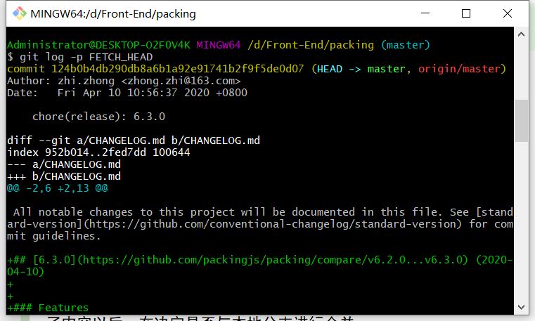
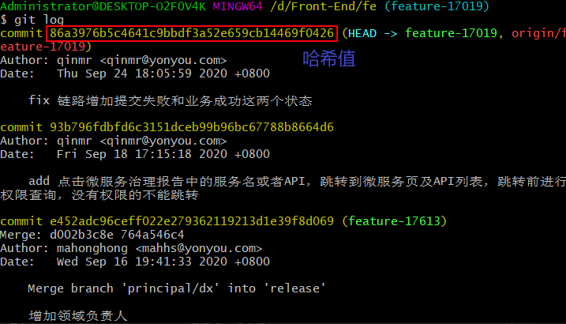

<!-- START doctoc generated TOC please keep comment here to allow auto update -->
<!-- DON'T EDIT THIS SECTION, INSTEAD RE-RUN doctoc TO UPDATE -->
**Table of Contents**  *generated with [DocToc](https://github.com/thlorenz/doctoc)*

- [1. 使用git过程中遇到的问题以及解决方式](#1-%E4%BD%BF%E7%94%A8git%E8%BF%87%E7%A8%8B%E4%B8%AD%E9%81%87%E5%88%B0%E7%9A%84%E9%97%AE%E9%A2%98%E4%BB%A5%E5%8F%8A%E8%A7%A3%E5%86%B3%E6%96%B9%E5%BC%8F)
  - [1.1 在使用`git pull`过程中，提示：错误 Please commit your changes or stash them before you merge.](#11-%E5%9C%A8%E4%BD%BF%E7%94%A8git-pull%E8%BF%87%E7%A8%8B%E4%B8%AD%E6%8F%90%E7%A4%BA%E9%94%99%E8%AF%AF-please-commit-your-changes-or-stash-them-before-you-merge)
- [2. git知识积累](#2-git%E7%9F%A5%E8%AF%86%E7%A7%AF%E7%B4%AF)
  - [2.1 git fetch和git pull的用法以及区别](#21-git-fetch%E5%92%8Cgit-pull%E7%9A%84%E7%94%A8%E6%B3%95%E4%BB%A5%E5%8F%8A%E5%8C%BA%E5%88%AB)
  - [2.2 从远端仓库拉取代码到本地仓库（非master分支）](#22-%E4%BB%8E%E8%BF%9C%E7%AB%AF%E4%BB%93%E5%BA%93%E6%8B%89%E5%8F%96%E4%BB%A3%E7%A0%81%E5%88%B0%E6%9C%AC%E5%9C%B0%E4%BB%93%E5%BA%93%E9%9D%9Emaster%E5%88%86%E6%94%AF)
  - [2.3 从远端仓库拉取代码到本地仓库（master分支）](#23-%E4%BB%8E%E8%BF%9C%E7%AB%AF%E4%BB%93%E5%BA%93%E6%8B%89%E5%8F%96%E4%BB%A3%E7%A0%81%E5%88%B0%E6%9C%AC%E5%9C%B0%E4%BB%93%E5%BA%93master%E5%88%86%E6%94%AF)
  - [2.4 同时使用github和gitlab](#24-%E5%90%8C%E6%97%B6%E4%BD%BF%E7%94%A8github%E5%92%8Cgitlab)
  - [2.5 如何在某个分支下建立自己的分支](#25-%E5%A6%82%E4%BD%95%E5%9C%A8%E6%9F%90%E4%B8%AA%E5%88%86%E6%94%AF%E4%B8%8B%E5%BB%BA%E7%AB%8B%E8%87%AA%E5%B7%B1%E7%9A%84%E5%88%86%E6%94%AF)
  - [2.6 修改分支名](#26-%E4%BF%AE%E6%94%B9%E5%88%86%E6%94%AF%E5%90%8D)
  - [2.7 版本回退（简单版）](#27-%E7%89%88%E6%9C%AC%E5%9B%9E%E9%80%80%E7%AE%80%E5%8D%95%E7%89%88)
  - [2.8 提交所有文件](#28-%E6%8F%90%E4%BA%A4%E6%89%80%E6%9C%89%E6%96%87%E4%BB%B6)
  - [2.9 删除暂存区的文件](#29-%E5%88%A0%E9%99%A4%E6%9A%82%E5%AD%98%E5%8C%BA%E7%9A%84%E6%96%87%E4%BB%B6)

<!-- END doctoc generated TOC please keep comment here to allow auto update -->

## 1. 使用git过程中遇到的问题以及解决方式

### 1.1 在使用`git pull`过程中，提示：错误 Please commit your changes or stash them before you merge.
- 原因：本地代码未及时提交，在和远端代码合并时，出现了冲突
- 解决方法：参考文章：[Git冲突：commit your changes or stash them before you can merge.](https://blog.csdn.net/lincyang/article/details/21519333)
  1. 使用`stash`命令
     ```
      git stash
      git pull
      git stash pop  
     ```
  2. 放弃本地修改，直接覆盖
     ```
      git reset --hard
      git pull
     ```
- 使用第二种方法，在使用之前，先将本地写好的代码备份，然后直接从远端的仓库拉过来，将本地代码覆盖，然后再将备份的代码写到文件中去。
     
## 2. git知识积累
### 2.1 git fetch和git pull的用法以及区别
1. 参考资料：[git fetch & pull详解](https://www.cnblogs.com/runnerjack/p/9342362.html)
2. 一张图展示git fetch和git pull的概念：
   - 图示：
   
     
     
     
     
3. `git fetch`
   - 命令的基本格式1：`git fetch <remote> <branch>`，`<remote>`表示远端的主机名，`<branch>`表示远端的分支名称。例如，分支为master，则可以这样写：`git fetch origin master`，如果是其他分支，如develop，可以这样写：`git fetch origin develop`。
   - 命令的基本格式2：` git fetch <remote>`，这个命令将某个远程主机的更新全部取回本地，例如：`git fetch origin`。
   - 作用：git fetch将远端分支的最新内容拉到本地，用户再检查了内容以后，在决定是否与本地分支进行合并。
   - 取回更新后，会返回一个FETCH_HEAD，指的是某个branch在服务器上的最新状态，我们可以在本地通过它查看刚取回的更新信息：`git log -p FETCH_HEAD`，如图所示：
   
     
     
      
   - 返回的信息包括更新的文件名，更新的作者和时间，以及更新的代码（**红色**部分表示删除，**绿色**部分表示新增）。通过这些信息来判断是否产生冲突，以确定是否将更新merge到当前分支。 
4. `git pull`
   - 命令的基本格式1：`git pull <remote> <branch>`，`<remote>`表示远端的主机名，`<branch>`表示远端的分支名称。例如，分支为master，则可以这样写：`git pull origin master`，如果是其他分支，如develop，可以这样写：`git pull origin develop`。
   - 命令的基本格式2：` git pull`，从远端仓库下载到本地仓库（从哪个分支下，就从远端仓库的那个分支下载）。
   - 作用：将远端分支的最新内容拉取到本地，并进行合并。有可能会出现冲突，需要手动解决。
   - git pull等同于：
     ```
        git fetch origin master
        git merge FETCH_HEAD
     ```
   - 第一条命令的作用是将远端仓库的master分支的最新内容拉取到本地。
   - 第二条命令的作用是将拉取到的最新内容合并到当前所处的本地分支中。
   
   
### 2.2 从远端仓库拉取代码到本地仓库（非master分支）
1. 初始化： `git init`

2. 与远端仓库建类连接：`git remote add origin git@github.com:XXXX/nothing2.git`

3. 把远程分支拉到本地：`git fetch origin dev`，dev为远端分支的名称

4. 在本地新建分支dev并切换到该分支：`git checkout -b dev(本地分支) origin/dev(远端分支)`

5. 把某个分支上的内容都拉取到本地：`git pull origin dev`，dev为远端仓库的名称

### 2.3 从远端仓库拉取代码到本地仓库（master分支）
1. 初始化： `git init`

2. 与远端仓库建类连接：`git remote add origin git@github.com:XXXX/nothing2.git`

3. 把远程分支拉到本地：`git fetch origin master`

4. 把某个分支上的内容都拉取到本地：`git pull origin master`

### 2.4 同时使用github和gitlab
1. 背景：在公司的电脑上需要同时使用github和gitlab，因此需要进行配置。

2. 首先配置全局的用户名和邮箱，这个设置为gitlab的用户名和邮箱，保证在任何项目下都可以连接到gitlab。
   - `git config --global user.name "name"` 全局配置gitlab的用户名
   - `git config --global user.email "email"` 全局配置gitlab的邮箱
   
3. 在需要上传到github的项目下，配置局部的用户名和邮箱，这个设置为github的用户名和邮箱。
   - `git config --local user.name "name"` 局部配置github的用户名
   - `git config --local user.email "email"` 局部配置github的邮箱
   
4. 配置ssh key。这个需要分别进行配置，也就是说，需要配置gitlab和github两个。

5. ssh key 默认生成后保存在 `~/.ssh/`目录下（Windows 10 的路径为：`C:\Users\Administrator\.ssh`），默认为 `id_rsa` 和 `id_rsa.pub` 两个文件，由于我们需要分开配置，配置步骤如下：
   1. `ssh-keygen -t rsa -f ~/.ssh/id_rsa.github -C "xxx@163.com"`，`xxx@163.com`是你的github的邮箱。这条命令在生成公私密钥对的同时制定文件名，表示github专用。`~/.ssh/id_rsa.github`表示生成的文件路径，包括文件名是`id_rsa.github`。
   
   2. `ssh-keygen -t rsa -C "aaa@xxx.com"`，`aaa@xxx.com`是你的gitlab的邮箱。这条命令用于生成默认的gitlab的公私密钥对。**注意：如果在最开始使用git的时候，已经生成了默认的gitlab公私密钥对，则这里不需要执行这个命令。**
   
6. 命令执行完成后，这时~/.ssh目录下会多出id_rsa.github和id_rsa.github.pub两个文件，id_rsa.github.pub 里保存的就是我们要使用的key，这个key就是用来上传到 Github上的。
   
7. 配置 config 文件
   - 在`~/.ssh`目录下，如果不存在config文件，则新建 config文件 ，文件内容添加如下：
      ```
        Host github.com
        IdentityFile ~/.ssh/id_rsa.github
        User xxx
      ```
      - 配置完成后，符合 *.github.com 后缀的 Git 仓库，均采取~/.ssh/id_rsa.github 密钥进行验证，其它的采取默认的。User后面的内容是你的github的用户名。
      
8. 上传public key 到 Github
   1. 登录github
   2. 点击右上方的Accounting settings图标
   3. 选择 SSH key
   4. 点击 Add SSH key
   5. 在出现的界面中填写SSH key的名称，填一个你自己喜欢的名称即可，然后将上面拷贝的`~/.ssh/id_rsa.github.pub`文件内容粘帖到key一栏，在点击“add key”按钮就可以了。
   6. 添加过程github会提示你输入一次你的github密码。
   
9. 验证是否OK
   - 由于每个托管商的仓库都有唯一的后缀，比如 Github的是 git@github.com:*，所以可以这样测试：`ssh -T git@github.com`，提示下面的信息：
   ```
        Hi windofme1109! You've successfully authenticated, but GitHub does not provide shell access.
   ```
   - 表示连接成功了。

### 2.5 如何在某个分支下建立自己的分支
1. 强调一个概念，比如说我们在A分支下建立B分支，指的是B分支使用了当前状态下，A分支的最新的代码，而不是A/B这种层级结构。
2. 我想在非主分支dev下新建一个分支：0831-dev，那么我们可以这样建立：
   1. 创建分支  
      - `git checkout -b 0831-dev`    创建并切换到新的的分支：0831-dev
   2. 定位分支  
      - `git checkout dev` 切换到dev下面，选择dev分支的状态内容  
      - `git pull origin dev`  拉取目标分支dev内容到本地分支
   3. 提交分支
      - `git checkout 0831-dev` 切换到0831-dev分支
      - `git add`
      - `git push -u origin 0831-dev` 将远端的0831-dev分支设置为本地分支0831-dev的上游。
3. 还可以在gitlab或者时github上基于某个分支建立自己的分支，然后将这个分支拉到本地。github或者gitlab上新建分支，都是基于某个分支建立的。

4. 实际上还有一种方法，就是直接在某个分支下，比如说是dev分支下，执行：`git checkout -b 0831-dev`，那么0831-dev就是基于dev这个分支建立的。  
   然后我们修改内容提交后，执行：`git push -u origin 0831-dev`，就能将当前的自己的分支推送到远端仓库。  
   如果我们需要将两个分支合并，使用`git merge`或者在webStorm中进行合并。
  
     
     
### 2.6 修改分支名

1. 假设原分支的名字是 oldName，要修改为 newName。

2. 修改本地分支的名称（未推送到远端）
   - `git branch -m oldName newName`
   
3. 远程分支重命名 （已经推送远程-假设本地分支和远程对应分支名称相同）
   1. 修改本地分支名称
      - `git branch -m oldName newName`
   
   2. 删除远端分支
      - `git push -delete origin oldName`
   
   3. 上传新分支
      - `git push --delete origin oldName`
      
   4. 把修改后的本地分支与远端分支关联
      - `git push --set-upstream-to origin/newName`

### 2.7 版本回退（简单版）

1. 背景：假设我们已经进行了几次提交，但是发现提交有问题，所以我们想回退到某个版本，放弃之前的提交。

2. 可以这样进行版本回退：
   
   1. 查看最近几次提交的哈希值
      - `git log`  
      
      哈希值如下图所示：
      
   
   2. 记录下需要回退到某次提交（版本）的哈希值
   
   3. 版本回退
      - `git reset --hard 哈希值`  
      `--hard` 表示删除前面的提交记录。而不是指针回退到当前的提交。
      
   4. 推送到远端，使得本地与远端保持同步
      - `git push -f origin 分支名`  
      `-f` 表示强制推送到远端，以覆盖之前的提交。

3. 如果只是简单的回退到上个版本，可以使用下面这个命令：
   - `git reset --hard head^`  
   `HEAD^` 表示上一个版本
   
### 2.8 提交所有文件

1. 添加所有变化：`git add -A`  

2. 添加被修改（modified）和被删除（deleted）文件，不包括新文件（new）：`git add -u`
  
3. 添加新文件（new）和被修改（modified）文件，不包括被删除（deleted）文件：`git add .`  

### 2.9 删除暂存区的文件

1. 有时我们误把文件使用`git add` 添加到暂存区，如果想把它从暂存区移除，但不是删掉文件，可以使用 `reset` 命令。

2. 从暂存区移除文件：`git reset HEAD -- path/to/file`

3. 从暂存区移除文件夹下的所有文件
   - 如果要移除文件夹下的所有文件，可以进入到文件夹，然后对文件夹执行：`git reset HEAD -- .`
   
4. 还可以使用 rm 命令：`git rm --cache file`