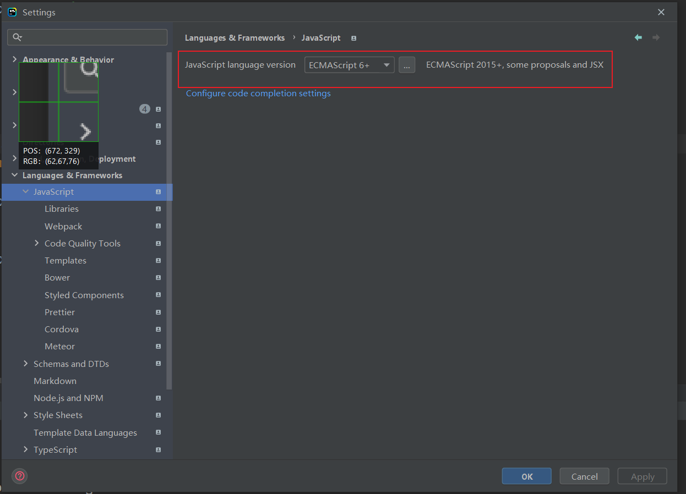
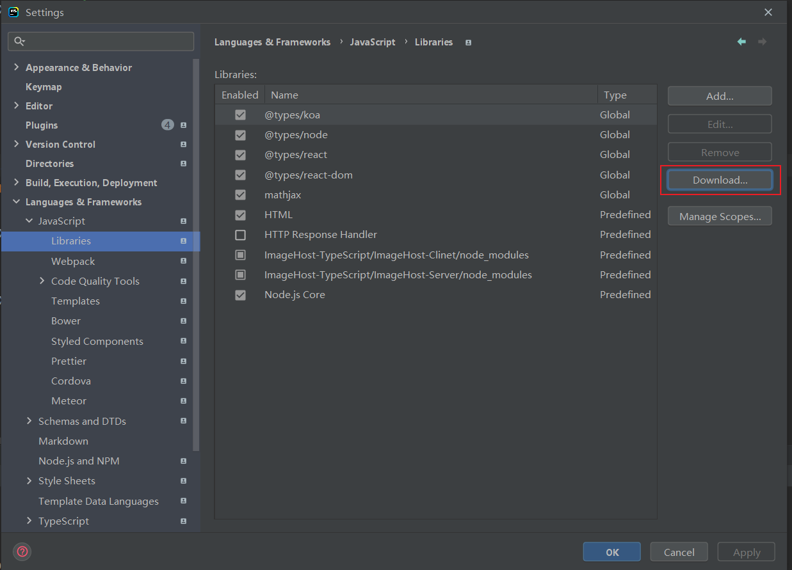
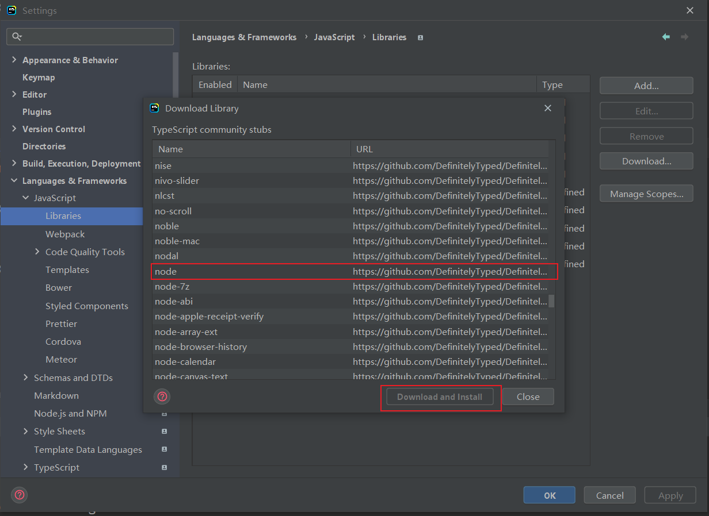
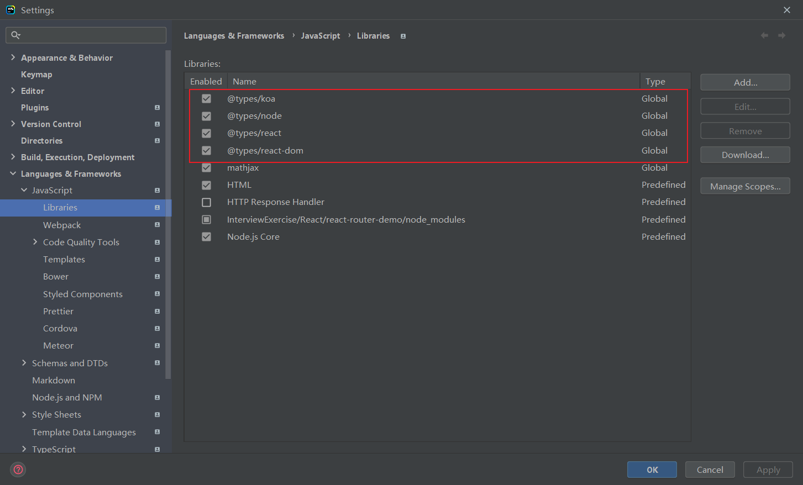
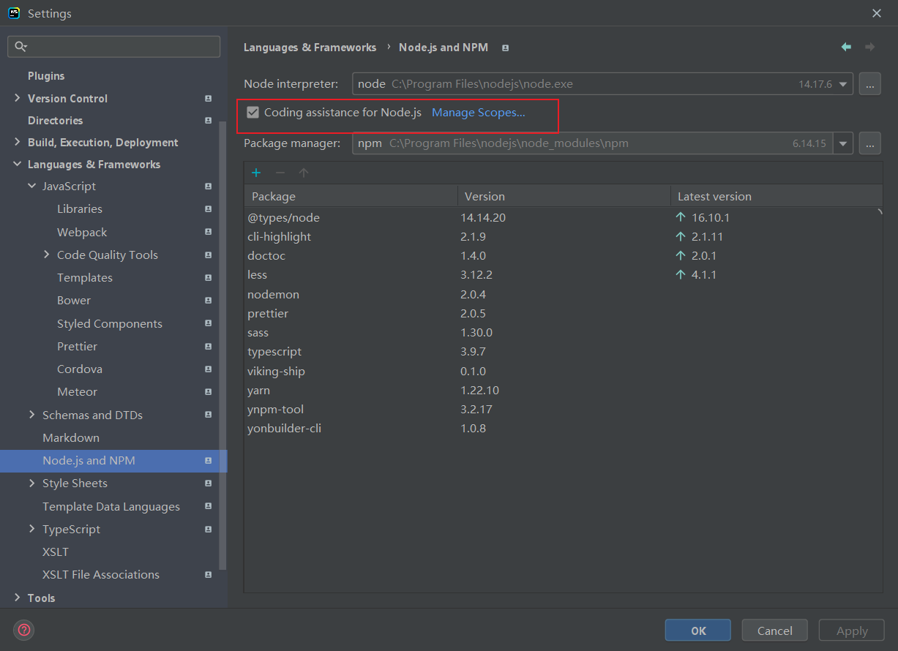
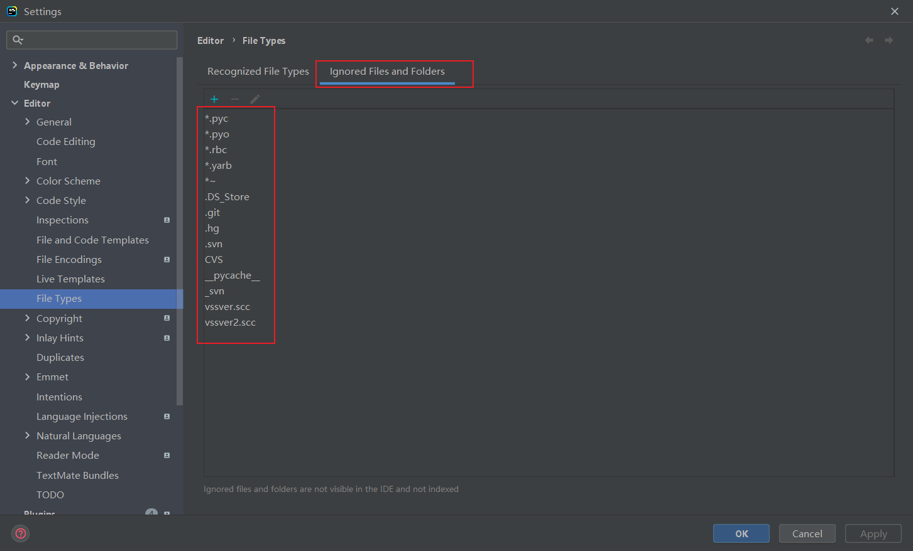

# Webstorm 设置对 Node.js 的智能提示

1. Webstorm 默认不会对 Node 代码进行提示，因此我们需要进行设置，使得 Webstorm 支持对 Node 代码的智能提示。

## 1. 参考资料

1. [Webstorm设置Node.js智能提示](https://www.cnblogs.com/yuwenjing0727/p/8116799.html)

2. [完美解决Webstorm不支持nodejs等语法提示和补全](https://blog.csdn.net/Dobility/article/details/87563057)

3. [Webstorm设置Node.js智能提示](https://www.cnblogs.com/tgxh/p/6293084.html)

## 2. 设置步骤

1. 设置路径：`File` -> `Settings` -> `Languages&Frameworks` -> `Javascript`：
   
   将 `JavaScript language version` 设置为 `ECMAScript 6+`，这样可以开启对 ES6+ 、jsx 的支持。

2. 选择下面的 libraries，如下所示：
   

3. 此时需要做的是下载类型定义文件。点击右侧的 Download，就会出现一个提示框，里面是可以下载的类型定义文件：
   
   选择 node，进行下载。当然我们也还可以下载其他框架或者包的类型定义文件，如 react、koa 等。

4. 下载完成以后，将其勾选上：
   

5. 在 `Node.js and NPM` 选项下，勾选 `Coding assistance for Node.js`，如下所示：
   

6. 如果还想得到第三方库的智能提示，我们需要将 node_modules 放开。默认情况下，Webstorm 不会对 node_modules 中的文件进行分析，当我们使用 node_modules 中第三方包的函数、变量、类的时候，Webstorm 自然不会给出提示。node_modules 内文件数量很大，Webstorm 分析起来影响性能，甚至卡死，和电脑性能相关。所以，如果电脑性能不够好的情况下，不建议开启分析 node_modules 的功能。

7. 在 `edit` -> `File Types` 中，找到 `Ignored Files and Folders`，如下所示：
   
   `Ignored Files and Folders` 下展示的都是被忽略的文件和目录，被忽略的内容在 IDE 中不可见且不会被加入索引。如果被忽略的内容中有 node_modules，就将其去掉。这样，当我们使用 node_modules 中第三方包的函数、变量、类的时候，Webstorm 会给出提示。