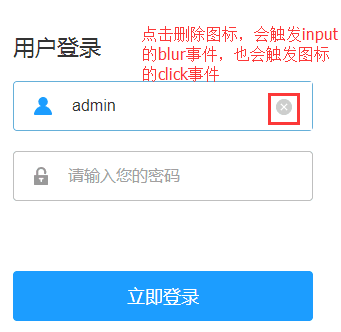

# 常见 JavaScript 需求总结

## 1. 失去焦点事件（blur）与点击事件（click）的执行顺序

1. 当我们点击 input 元素以外的其他区域时，会触发 input 的失去焦点事件。如果其他区域绑定了点击事件，那么失去焦点事件要比点击事件更先触发。

2. 举一个例子（该示例来自于：[blur事件与click事件冲突的解决办法
](https://blog.csdn.net/caicai1171523597/article/details/86639933)）：当我们在输入框输入内容输入框获取到焦点时，输入框后面会出现一个图标删除已输入的内容，因此删除图标会绑定一个 click 事件，但是当我们点击图标的时候，也触发了 input 的 blur 事件，blur 事件会让 input 失去焦点时隐藏删除的图标，并且 blur 事件先于图标的 click 事件执行，因此这时候点击图标并不会删除输入框已输入的内容，而是图标消失了，那么这个结果就不是我们想要的。
   

3. blur 事件：当元素失去焦点时触发 blur 事件；早前，blur 事件仅发生于表单元素上。在新浏览器中，该事件可用于任何元素，blur 和 focus 事件不会冒泡，其他表单事件都可以。

4. click 事件：当点击元素时触发 click 事件；所有元素都有此事件，会产生冒泡。

5. 由于 js 引擎是单线程的，同一时间段内只能执行一个任务，而 blur 事件优先触发，所以，当执行 blur 事件的处理函数时，不会响应后面的 click 事件。

6. 解决方法 - 1：给 blur 事件加定时器延迟触发，使得 click 事件先于 blur 事件执行。
   ```js  
      /*删除图标的点击事件*/
       $(".delete-icon").on("click",function () {
          $(this).prev("input").val("").focus();
       });
       /*输入框失去焦点的blur事件*/
       $("input[name='username'],input[name='password']").on("blur",function () {
          var $this = $(this);
          setTimeout(function(){
             $this.parent().removeClass("active");
             $this.next(".delete-icon").hide();
         },250)

   ```
   缺点：设置多久的延时是一个难以两全的问题，时间太短不能保证 click 事件的 100% 触发，时间太长则会造成卡顿的感觉，影响用户体验。

7. 解决方法 - 2：将 click 事件改为mousedown 事件，mousedown 事件是优先于 blur 事件执行。
   ```js
       /*删除图标的点击事件*/
            $(".delete-icon").on("mousedown",function () {
                $(this).prev("input").val("").focus();
            });
           /*输入框失去焦点的blur事件*/
            $("input[name='username'],input[name='password']").on("blur",function () {
                var $this = $(this);
                $this.parent().removeClass("active");
                $this.next(".delete-icon").hide();
            });
   ```          
   缺点：鼠标按下便触发了事件，不收起、长按也会触发，可能造成用户体验不好。

8. 解决方法 - 3：给图标再添加一个 mousedown 事件，在其中执行 `event.preventDefault()` 阻止浏览器默认事件，这样点击按钮时输入框就不会失去焦点了
   ```js
      /*阻止浏览器默认事件*/
            $(".delete-icon").on("mousedown",function(e) {
                e.preventDefault();
            })
            /*删除图标的点击事件*/
            $(".delete-icon").on("click",function () {
                $(this).prev("input").val("").focus();
            });
           /*输入框失去焦点的blur事件*/
            $("input[name='username'],input[name='password']").on("blur",function () {
                var $this = $(this);
                $this.parent().removeClass("active");
                $this.next(".delete-icon").hide();
            });
   ```
           
9. 解决方法 - 4：动态绑定 blur 事件，当鼠标进入 input 框父级元素时，移除 input 绑定事件 blur，当鼠标移出输入框父级元素时，给 input 绑定 blur 事件
   ```js
      /*动态绑定blur事件*/
            $(".login-con li").mouseenter(function(){
                $(this).find("input").unbind("blur");
            });
            $(".login-con li").mouseleave(function(event){
                $(this).find("input").bind("blur");
            });
           /*删除图标的点击事件*/
            $(".delete-icon").on("click",function () {
                $(this).prev("input").val("").focus();
            });
           /*输入框失去焦点的blur事件*/
            $("input[name='username'],input[name='password']").on("blur",function () {
                var $this = $(this);
                $this.parent().removeClass("active");
                $this.next(".delete-icon").hide();
            }); 
   ```

10. 参考资料：[blur事件与click事件冲突的解决办法
](https://blog.csdn.net/caicai1171523597/article/details/86639933)

## 2. mousedown、click、mouseup 的区别

1. mousedown
   - 当鼠标指针移动到元素上方，并按下鼠标按键（左、右键均可）时，会发生 mousedown 事件。
   - 与 click 事件不同，mousedown 事件仅需要按键被按下，而不需要松开即可发生。

2. mouseup
   - 当在元素上松开鼠标按键（左、右键均可）时，会发生 mouseup 事件。
   - 与 click 事件不同，mouseup 事件仅需要松开按钮。当鼠标指针位于元素上方时，放松鼠标按钮就会触发该事件。

3. click
   - 当鼠标指针停留在元素上方，然后按下并松开鼠标左键时，就会发生一次 click 事件。
   - 注意：触发 click 事件的条件是按下并松开鼠标左键！，按下并松开鼠标右键并不会触发click事件。

4. 三个事件的触发顺序
   - 若在同一个元素上按下并松开鼠标左键，会依次触发 mousedown、mouseup、click，前一个事件执行完毕才会执行下一个事件。
   - 若在同一个元素上按下并松开鼠标右键，会依次触发 mousedown、mouseup，前一个事件执行完毕才会执行下一个事件，不会触发 click 事件。

5. 参考资料：
   - [JavaScript区分click事件和mousedown（mouseup、mousemove）方法](https://www.bbsmax.com/A/8Bz8xRkzxg/)
   - [mousedown、mouseup、click事件之间的关系及执行顺序](https://blog.csdn.net/cccmercy/article/details/80775540)

## 3. e.target、e.currentTarget 和 e.relatedTarget 的区别

1. e.target
   - 触发事件的对象 (某个 DOM 元素) 的引用。也就是具体触发事件的那个元素。因为事件具有冒泡特性，因此可以将事件处理函数绑定到某个元素的父级元素上，然后使用 e.target 来区分具体事件发生在哪个子元素上。这也是常说的事件委托。

2. e.currentTarget
   - 这是一个只读属性。返回绑定事件处理函数的 DOM 元素。也就是说，我将事件处理函数绑定到哪个元素，e.currentTarget 就指向哪个元素，这个元素不一定是实际触发事件的元素。

3. e.currentTarget 与 e.target 的区别
   - currentTarget 始终是绑定事件的对象; target是触发事件的实际目标。
   - 如果我们使用事件委托，e.currentTarget 用于获取绑定事件处理函数的父元素，e.target 用于实际触发事件的子元素。
   - 如果不使用使用事件委托，这种情况下 e.target 完全等同 e.currentTarget，都指向同一个绑定事件处理函数的元素。

4. e.relatedTarget
   1. relatedTarget 事件属性返回与事件的目标节点相关的节点。
   2. 对于 mouseover 事件来说，该属性是鼠标指针移到目标节点上时所离开的那个节点。
   3. 对于 mouseout 事件来说，该属性是离开目标时，鼠标指针进入的节点。
   4. 对于其他类型的事件来说，这个属性没有用。

5. 参考资料：
   - [彻底弄懂小程序e.target与e.currentTarget](https://www.cnblogs.com/novice007/p/8143989.html)
   - [Event.target](https://developer.mozilla.org/zh-CN/docs/Web/API/Event/target)
   - [Event.currentTarget](https://developer.mozilla.org/en-US/docs/Web/API/Event/currentTarget)
   - [小程序中 e.target和e.currentTarget的区别总结](https://blog.csdn.net/weixin_39161276/article/details/85284248)
   