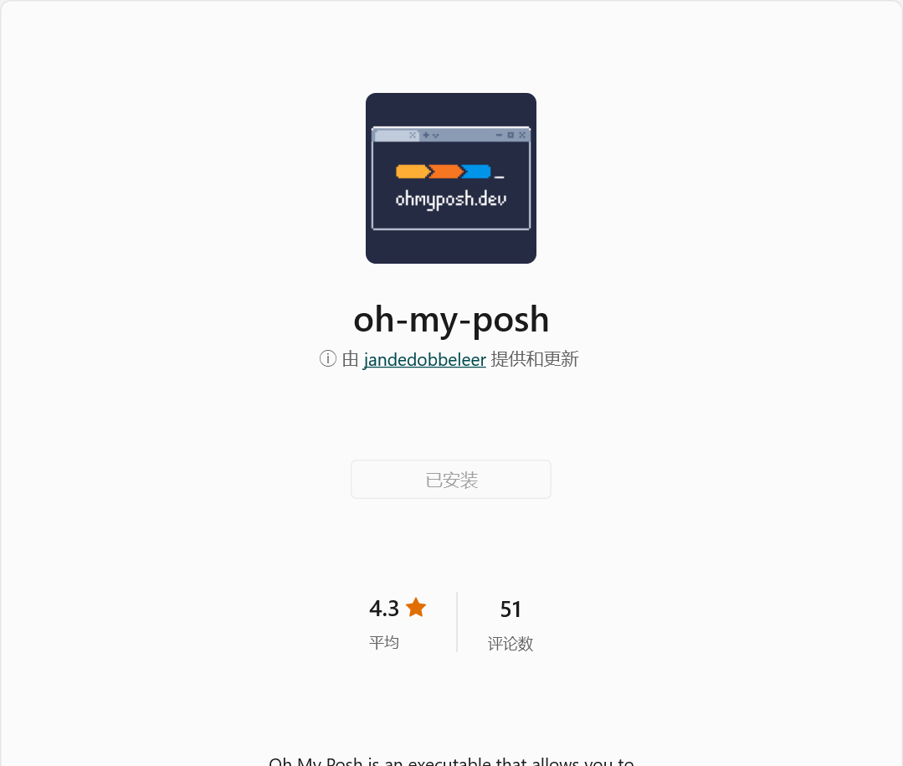
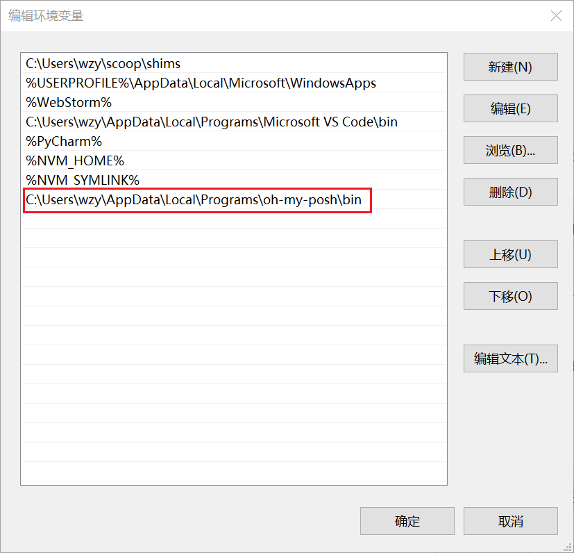
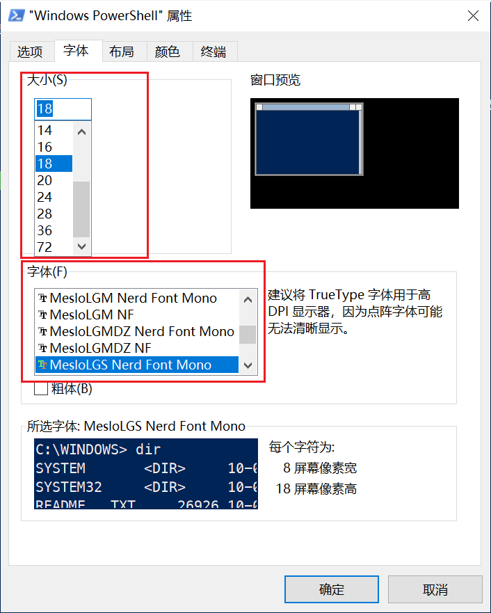
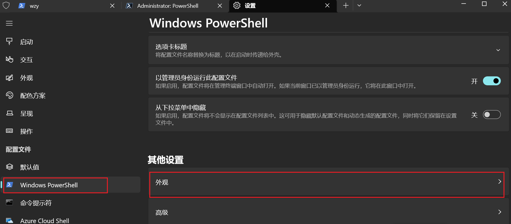
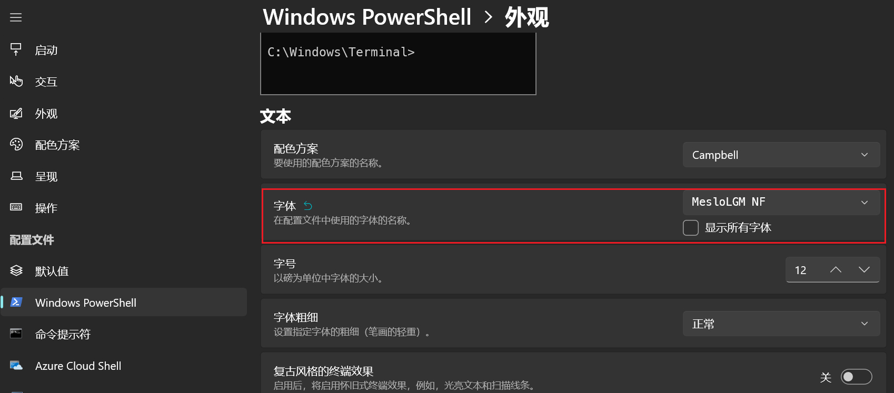

# 安装 oh-my-posh 美化 PowerShell

## 1. 参考资料

1. [oh-my-posh安装和配置避坑指南](https://www.cnblogs.com/watalo/p/16407059.html)

2. [import-module](https://learn.microsoft.com/zh-cn/powershell/module/microsoft.powershell.core/import-module?view=powershell-7.3)
2. [about_profiles](https://learn.microsoft.com/zh-CN/powershell/module/microsoft.powershell.core/about/about_profiles?view=powershell-7.3&viewFallbackFrom=powershell-7)
2. [使用winget安装软件](https://zhuanlan.zhihu.com/p/531070818)
2. [在 Windows 上安装 PowerShell](https://learn.microsoft.com/zh-cn/powershell/scripting/install/installing-powershell-on-windows?view=powershell-7.3#winget)
2. [Window Terminal 安装以及使用(2021最新)](https://zhuanlan.zhihu.com/p/351281543)
2. [about_psreadline](https://learn.microsoft.com/zh-cn/powershell/module/psreadline/about/about_psreadline?view=powershell-7.3)

## 1. 背景

1. 在 MacOS 或者是 Linux 上，一款常用的命令行工具是 zsh，zsh 功能很强大，但是默认的样式很普通，因此，想要让 zsh 的样式变得好看，我们需要借助 oh-my-zsh 这个命令行装饰工具，它基于 zsh 命令行，提供了主题配置，插件机制，已经内置的便捷操作。

2. 而 Windows 下的命令行工具有 PowerShell 和 CMD。其默认的样式也很普通，那么有没有针对于 PowerShell 和 CMD 的命令行装饰工具呢，答案是有的，就是 oh-my-posh，一款专门针对 PowerShell 进行装饰的工具。

3. [ohmyposh](https://ohmyposh.dev/) 是一个提示主题引擎，可以用于任何 shell（命令行工具）。可以运行在 Linux、MacOS 和 Windows 上。本文主要是介绍 oh-my-posh 在 Windows 平台上的安装和使用。

4. 使用 oh-my-posh 美化 PowerShell 主要是包含以西几个步骤：
   - 安装 oh-my-posh
   - 安装字体（Nerd Fonts）
   - 配置 PowerShell
   
## 2. 安装 oh-my-posh

1. oh-my-posh 的官网是：https://ohmyposh.dev/。

2. oh-my-posh 有多种安装方式，包括从 Microsoft Store、Winget、Scoop、Chocolate 等安装方式。总体来说，分为两种：
   - Microsoft Store 安装
   - 命令行安装

### 1. Microsoft Store 安装

1. 直接在 Microsoft Store 中搜索 oh-my-posh，然后安装：


### 2. Winget

1. Winget 是微软官方提供的一个安装和管理软件的命令行工具，可以理解为是命令行版本的 Microsoft Store。

2. Winget 的 github 地址：[winget](https://github.com/microsoft/winget-cli)

3. 通过 Winget 安装 oh-my-posh 的命令是：
   `winget install JanDeDobbeleer.OhMyPosh -s winget`

4. 通过 Winget 的方式安装软件，由于 Winget 的源在国外，所以安装非常缓慢，还会出现失败的情况，因此不推荐使用 Winget 的方式安装 oh-my-posh。

### 3. Scoop

1. Scoop 是 windows 平台上的第三方包管理工具。

2. Scoop 的官网：https://scoop.sh/

3. 因为 Scoop 不是 Windows 自带的工具，在使用 Scoop 前需要安装 Scoop，安装方法可以参考官网介绍的方式。

4. 通过 Scoop 安装 oh-my-posh 的命令是：
   `scoop install https://github.com/JanDeDobbeleer/oh-my-posh/releases/latest/download/oh-my-posh.json`

5. 由于 Scoop 的源服务器上有 oh-my-posh，所以也可以直接安装：`scoop install oh-my-posh`

### 4. Chocolate

1. Chocolate 是 windows 平台上的第三方包管理工具。

2. Scoop 的官网：https://chocolatey.org/

3. 因为 Chocolate 不是 Windows 自带的工具，在使用 Chocolate 前需要安装 Chocolate，安装方法可以参考官网介绍的方式。

4. 通过 Chocolate 安装 oh-my-posh 的命令是：
   `choco install oh-my-posh`

### 5. 检查 oh-my-posh 是否添加到系统路径（path）中

1. 因为后面要用到 oh-my-posh 的命令，所以需要将 oh-my-posh 添加到系统路径中。这个添加过程是软件安装过程中自动完成的，我们只需要要检查一下即可，没有添加的话，需要我们手动添加。

2. 在 Windows 10 寻找系统路径如下：此电脑 -> 属性 -> 系统高级设置 -> 高级 -> 环境变量。

3. 一个当前用户变量，一个是系统变量，我们去当前用户变量中查看。找到 path 这个选项，双击打开：
   

4. 从上图中可以看出，oh-my-posh 已经添加到系统路径中，因此可以使用 oh-my-posh 的命令了。

5. 还要确定环境变量中是否有 POSH_THEMES_PATH 这个变量，这个变量是用来指定 oh-my-posh 的主题的位置，后面配置脚本需要这个变量。

6. oh-my-posh 的主题是存放在安装目录下的 themes 这个文件夹下。

## 3. 安装字体

1. oh-my-posh 需要配合使用 Nerd Fonts 字体。Nerd Fonts 除了提供了字体，还提供了一些图标。推荐使用 Meslo LGM NF 字体，但是 oh-my-posh 和任何 Nerd Fonts 字体配合使用。

2. Nerd Fonts 字体的官网：[Nerd Fonts](https://www.nerdfonts.com/)

3. 有两种方式安装 Nerd Fonts：
   1. 直接去其官网，选择合适的字体进行下载
   2. 使用 oh-my-posh 命令安装字体：`oh-my-posh font install`，在其给定的字体列表中安装一款。

4. 推荐使用第一种安装方式。

5. 安装完字体以后，需要将命令行工具的字体指定为我们刚刚下载的字体。

### 1. 配置 PowerShell 的字体

1. 打开 PowerShell，选择属性 -> 字体，如下图所示：


2. 选择我们刚刚下载的 nerd fonts 字体即可。

### 2. 配置 Windows Terminal 字体

1. Windows Terminal 可以从 Microsoft Store 进行安装，目前是 Windows 平台上比较推荐的命令行工具。

2. 配置 Windows Terminal 字体的方式有两种：
   - 编辑 setting.json
   - 直接配置
3. 编辑 setting.json：打开 Windows Terminal，按下快捷键：`CTRL + SHIFT + ,`，打开 setting.json 文件，在 profiles 字段下的 defaults 自字段下 添加 `font.face` 属性，设置其值为 `MesloLGM NF`，也就是我们需要的 Nerd Fonts 字体，具体配置如下：
```json
   {
      "profiles": {
              "defaults": {
                      "font": {
                              "face": "MesloLGM NF"
                      }
              }
      }
   }
```

4. 直接配置：打开 Windows Terminal 的设置页面，找到 PowerShell 的配置文件，找到外观选项，点击进入外观选项，就可以看到字体选项：

5. 

## 4. 配置 PowerShell

1. 安装完 oh-my-posh 以后，需要将 oh-my-posh 应用到 PowerShell 上，所以需要配置 PowerShell。

2. 关于 PowerShell 的配置文件的介绍：[about_profiles](https://learn.microsoft.com/zh-CN/powershell/module/microsoft.powershell.core/about/about_profiles?view=powershell-7.3&viewFallbackFrom=powershell-7)

3. 配置文件简介：
   > PowerShell 配置文件是在 PowerShell 启动时运行的脚本。 可以使用配置文件作为启动脚本来自定义环境。 可以添加命令、别名、函数、变量、模块、PowerShell 驱动器等。 还可以将其他特定于会话的元素添加到配置文件中，使其在每个会话中可用，而无需导入或重新创建它们。

4. 我们可以在 PowerShell 中输入 $PROFILE 来查看配置文件的路径。

5. 使用 `notepad $PROFILE` 可以打开 PowerShell 的配置文件，如果提示没有这个文件，需要我们手动新建一个。

6. 新建一个 PowerShell 配置文件的命令：
   ```shell
      if (!(Test-Path -Path <profile-name>)) {
          New-Item -ItemType File -Path <profile-name> -Force
      }
   ```

7. 打开配置文件：`notepad $PROFILE`，向配置文件中添加：
```shell
   oh-my-posh init pwsh --config "$env:POSH_THEMES_PATH\gmay.omp.json" | Invoke-Expression
```
8. 这句命令的意思是初始化一个指定的主题。`POSH_THEMES_PATH` 就是上面提到的环境变量中 主题的路径，`gmay.omp.json` 是某一个具体的主题。

9. 用 `get-poshThemes` 命令查看 `oh-my-posh` 提供的主题，然后去配置文件中修改加载的主题名称，即可实现主题的切换。

10. **注意**：Windows 自带了一个 PowerShell，我们也可手动安装一个 PowerShell 7，两个 PowerShell 可以共存，同时需要设置两个 PowerShell 的配置文件。